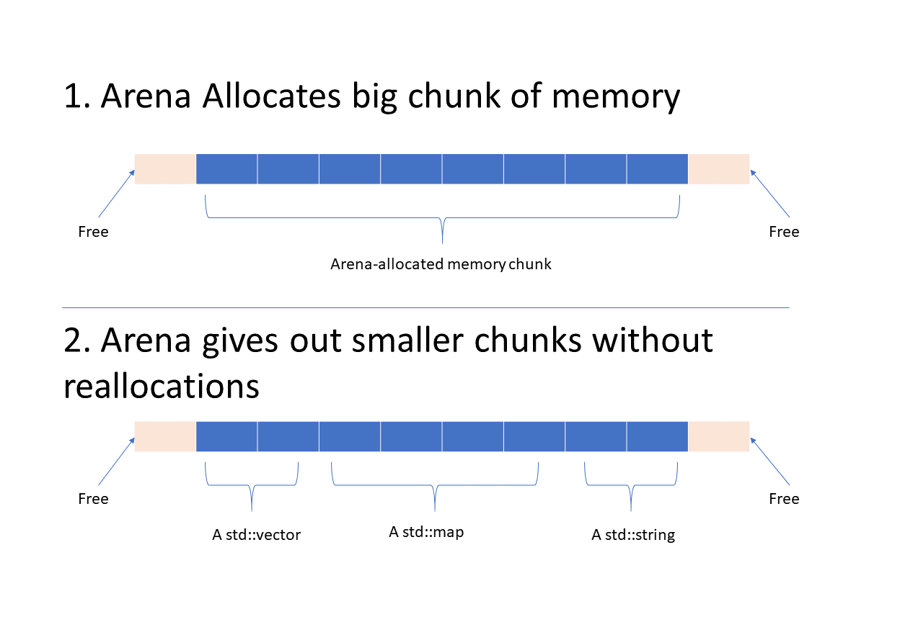

> "Computers are really fast" said my friend to me a while ago, as I was trying to figure out how to optimize the hottest path in my service. "It is almost always the IO" he added. It's been 3 years since, and I have learnt a bit more about computers, but I still clearly recall his saying as the root cause for too many problems.

Writing fast C++ services is a mix of following the right patterns, while, obviously enough, evading the wrong patterns. I would like to focus in this post on memory-related topics, for the reason my good friend mentions above.

*Tl;dr*: use arenas and object pools, use vectors sometimes, and don't allocate on the hot path.

- [The Right Tools](#the-right-tools)
  - [Arena Allocators](#arena-allocators)
  - [Object Pools](#object-pools)
- [The Right Data Structures](#the-right-data-structures)
  - [`std::vector` is king](#stdvectoris-king)
    - [A word of caution:](#a-word-of-caution)
  - [Don't be afraid of hybrid data structures](#dont-be-afraid-of-hybrid-data-structures)
- [The Wrong Practices](#the-wrong-practices)
  - [Allocating on the hot path](#allocating-on-the-hot-path)
  - [std::map er'ything](#stdmap-erything)
- [Final Words](#final-words)

## The Right Tools

Having the right tools at an arm's length, and getting comfortable using them can make the difference between fast and slow code.

### Arena Allocators

`Arenas` are awesome. Basically, they pre-allocate big chunks of memory when they are created, then they work as a memory manager. That big sloth object that you need to allocate a 1000 of, and it causes your services to hang for several precious milliseconds? No need. `Arenas` will give out that memory at runtime at almost no performance surcharge (given that it's needed to pre-configure them to have enough memory beforehand).



Google has a decent [implementation](https://developers.google.com/protocol-buffers/docs/reference/arenas), or if you're feeling adventurous go write your own implementation! Heads-up, Integrating it with STL can be a tad tricky.

### Object Pools

Some objects are just expensive to construct. Instead of doing that millions of time over the course of an service's uptime, why not just do it a few dozen times, and re-use them? That's what `Object Pools` are. For example:

```cpp
class Program
{
public:
    Program() = default;

    void RepeatedOperation
    {
    auto expensiveObject = myObjectPool.TakeOne();
    // use the expensive object
    ....
    // When we're done using it, it's returned to the pool and can be re-used
    }

    // To top it off, 'RepeatedOperation' is thread-safe! Every thread gets its own instance.

private:
    ObjectPool<ExpensiveObject> myObjectPool;
};
```

There's a [nice explanation](https://sourcemaking.com/design_patterns/object_pool) for the pattern. I highly recommend getting one's hand dirty with an example. Getting those two techniques in one's toolbox can get you far in terms of performance!

## The Right Data Structures

Not all Data structures are created equal. Different situations call for different ones, and our go-tos are not always optimal.

### `std::vector` is king

Vector achieves a sweet spot between ease of use, as well as high efficiency through data locality. It allows you to just occupy a memory block, as is:

```cpp
td::vector<int> vec{1,2,3};
char* ptr = reinterpret_cast<char*>(vec.data()); // Of course it's possible to use an int*, but char* has the advantage of accessing memory 1 byte at a time
std::cout << reinterpret_cast<int*>(*ptr) << std::endl; // Outputs 1, the first element
ptr = ptr + 4; // Add 4 bytes (size of an int)
std::cout << reinterpret_cast<int*>(*ptr) << std::endl; // Outputs 2, the second element
```

The code above shows how what you see in a vector is what you get. That's why in my day-to-day coding, vector is by far my most used data structure. Memory is arranged in the same way it's expected to be, and that's very nice for cache.

See, cache lines are usually 64 bytes. That means whenever you access an element, say `vec[1]`, not only this element gets cached. Rather, the whole cache line gets cached, which usually means its surroundings are also put in cache. And memory access is not so bad any more!

#### A word of caution:

Vectors are sweet, but in order to fully exploit their powers, it's always recommended to reserve them first. `std::vector` offers the great `reserve()` method to allow for alleviating some of the pains of allocating memory on the hot path. Of course, we cannot always know how big vectors are going to be. But when we do ...

### Don't be afraid of hybrid data structures

As nice as it might be to always use a std::vector<>, some situations ask for a more complicated data structures. A prime example of that is [boost::small_vector<T>](https://www.boost.org/doc/libs/1_69_0/doc/html/boost/container/small_vector.html). I, for one, was very happy when I found out such a thing exists! It's basically the child of an array + vector. It does not use dynamic allocation, unless it grows over a `constexpr N`, in which case it starts allocating. A prime use case is when it's *expected* to have no more than `N` elements, but it's not the end of the world if we need one or two more elements.

## The Wrong Practices

Not trying to sound standoffish, but these are a couple of my pet-peeves.

### Allocating on the hot path

Allocate all (at least most) of the memory needed at startup, before serving traffic (opening the port). The tools mentioned above (Arenas + Object Pools) can make a perfect team to achieve that. On a typical month, a change adding a memory allocation on the hotpath is responsible for 90% of latency pumps. Unfortunately, as much as arenas offer of help to latency, in my experience, they are usually alien to the codebase hosting them, unless it's an arena-native code (kudos!). Having no previous experience using them makes it extra hard to add changes too.

### std::map er'ything

Now I have no problem with std::map, but over-using them can be bad sometimes. For maps to offer O(logn) search, n is gotta be sizeable. If N is gonna be 3 elements, it's almost never worth the hassle of a map. An array together with linear search is [usually faster](https://terrainformatica.com/2017/10/15/when-linear-search-is-faster-than-stdmapfind-and-stdunordered_mapfind/). Keep in mind that maps/sets always allocate (unless an arena is used). Unlike vectors, we can't reserve() maps.

## Final Words

This is by far an incomplete set. For example, there are many topics that could have been covered including threading and communication models, but I hope I can cover these in their own posts.

My point of view is a bit painted by my cloud backgound, but I would expect this to apply in other areas of native programming. Let me know what's on your hot list in the comments! (especially for other languages!)