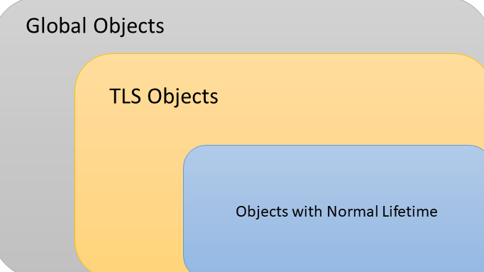

#### or *Why it is hard to get Graceful Shutdowns right*

I used to think shutdowns are easy. You're shutting down and the OS is going to take care of all my resources. Unfortunately, that's not completely the case. Shutdowns are easy, but perfectly graceful ones are not as intuitive. Ungraceful shutdowns bring about crashes, or even worse, unpredicted change to [state](https://www.bizety.com/2018/08/21/stateful-vs-stateless-architecture-overview/), and nobody likes either.

*Disclaimer*: Most of my knowledge is limited to windows scenarios, but I'd imagine most modern Operating Systems have parallel paradigms.

*tl;dr*: globals and TLS objects can make graceful shutdown a nightmare

- [Pressing "X" sends a signal](#pressing-%22x%22-sends-a-signal)
  - [Different Exit Signals in Windows](#different-exit-signals-in-windows)
  - [Using a Ctrl handler](#using-a-ctrl-handler)
- [Threads & Global Objects make things tough](#threads--global-objects-make-things-tough)
- [Just don't bother with TLS](#just-dont-bother-with-tls)

## Pressing "X" sends a signal

To start things off, let's see what happens when a user ends the application pro-actively. In other words, an exit is triggered by the outside world.

When a user presses close or "X", OS starts a thread in the process (OS is all mighty and it can do such things) and this thread executes signal handling code. The way this works exactly depends on the signal raised.

### Different Exit Signals in Windows

Pressing X in Windows emits a `CTRL_CLOSE_EVENT` signal. However, that is not the only signal the user can send to end an app. Others include `CTRL_BREAK_EVENT` (SIGBREAK) and `CTRL_C_EVENT` (SIGINT) that we use frequently to end apps in the command line without having to close the CMD window. There's also shutdown/logoff events but I am not going to discuss those.

Note: In case you'd like to play around a bit with sending signals, I would personally recommend [windows-kill](https://github.com/alirdn/windows-kill). The old defacto was [SendSignal](http://web.archive.org/web/20170909040729/http://www.latenighthacking.com/projects/2003/sendSignal/) but it didn't work well enough for myself and [others](https://stackoverflow.com/questions/25142403/in-windows-7-how-to-send-a-ctrl-c-or-ctrl-break-to-a-separate-process/53949491#53949491).

### Using a Ctrl handler

While Windows theoretically can just kill apps when users want, that would get a lot of developers mad, including Windows dev themselves. Apps need some time to clean up resources it has consumed, for example saving current work it is doing, or letting the client in a web app know it is shutting down. Because of these reasons, windows allow devs to handle those signals first.

For Windows Console apps, `SetConsoleCtrlHandler` is the right way to achieve this. For example:

```cpp
#include <Windows.h>

int main()
{
static bool useWantsToExit = false;
::SetConsoleCtrlHandler([](DWORD eventType) {
switch (eventType)
{
case CTRL_C_EVENT:
case CTRL_BREAK_EVENT:
useWantsToExit = true;
return TRUE;
}

// We got an unknown signal, ignore
return FALSE;
}, TRUE);

RunMainAppLogic();

// Add a blocking wait to prevent main from returning unless user wants to exit
while (!useWantsToExit)
{
// Sleep in order not to waste cycles
Sleep(500);
}

CleanupResources();

// Exit gracefully
return 0;
}
```

It's possible to add more and more handlers by doing more calls to `SetConsoleCtrlHandler`. According to [MS Docs](https://docs.microsoft.com/en-us/windows/console/setconsolectrlhandler), handlers are added in a stack and the last handler appended is the first to get executed. Then, if any of them returns true, this list is not processed anymore.

I have not included `CTRL_CLOSE_EVENT` above because it's special. While handling `CTRL_C_EVENT` and `CTRL_BREAK_EVENT` lets the program continue, that's not the case for Close, which is the result of pressing `X`. For this one, Windows gives a time limit to the app to exit, after which it kills it no matter what. I could not find documentation for how long that period is, but on my machine, it's about 5 seconds.

## Threads & Global Objects make things tough

Let's get real -- and make things a little complicated. While single-threaded applications with no global objects or state could be straightforward as shown in the snippet above, that's not really exciting (or fast), is it?

Let's first see how processes exit in Windows. There are multiple ways, but the one we're discussing here involves windows terminating the process by spawning a thread that calls `ExitProcess()`. This triggers a series of events, the interesting ones for us are about threads and global resources.

Global resources are tricky. They are constructed & deconstructed by the C runtime. To overly simplify things, let's assume they are constructed before calling main, and deconstructed after all threads signal to the kernel that they have exited.

See the gotcha here? It's the responsibility of the application to relieve any dependency by global objects on threads during those 5 seconds cleanup. Even with heavy use of counter-based pointers, things can get out of hand, for example, if global objects keep others alive for too long by holding on a reference to them. Trying to destruct those abruptly could trigger access violation. For example:

```cpp
struct ServiceHolder
{
std::shared_ptr<Service> heldService;
} globalServiceHolder;

int main()
{
foo* n = new foo();;
globalServiceHolder.heldService = std::make_shared<Service>(&n);

DoWorkInAnotherThread();

::SetConsoleCtrlHandler(signalHandler, TRUE);
while (!signaled)
{ }


delete n;

// n has died but service is kept alive by globalServiceHolder
// Trying to access n now is UB
return 0;
}
```

In order to keep things safe, the below model makes sense for which objects can make references to which objects:



In short, bigger rectangles cannot assume smaller ones are alive, especially in their destructors.

## Just don't bother with TLS

I am not a TLS fan, and I might go into more details into that in another post, but as the last section, I would like to wave a special warning for why TLS (Thread Local Storage) is evil in this context.

The standard way to initialize TLS storage is using the keyword `thread_local`(*shutter*). E.g.:

```cpp
#include <iostream>
#include <thread>

void foo()
{
static int staticvar = 0;
thread_local int tlsvar = 0;
staticvar++;
tlsvar++;
std::cout << "staticvar: " << staticvar << std::endl;
std::cout << "tlsvar: " << tlsvar << std::endl;
}

int main()
{
std::cout << "Output for thread #1: " << std::endl;
std::thread t1;
t1 = std::thread(foo);
t1.join();

std::cout << std::endl << "Output for thread #1: " << std::endl;
t1 = std::thread(foo);
t1.join();

return 0;
}

//std output:
//
//Output for thread #1:
//staticvar: 1
//tlsvar : 1
//
//Output for thread #1:
//staticvar: 2
//tlsvar : 1
```

The problem with TLS is mostly about the added complexity. On one hand, lifetime management becomes even more complicated, especially that there's if there's TLS, there are usually global objects and lifetimes have to be managed carefully. On the other hand, maintaining TLS code is no fun. It is a bit of a steep curve and I have rarely seen anyone making a change to a TLS-heavy part of the code, for the first time, bug-free.In my experience, a mix of [thread & object pools](https://mahdytech.com/2018/12/30/what-happens-when-you-press-x/2018/12/23/fast-services-cpp/) can replace TLS in most cases.