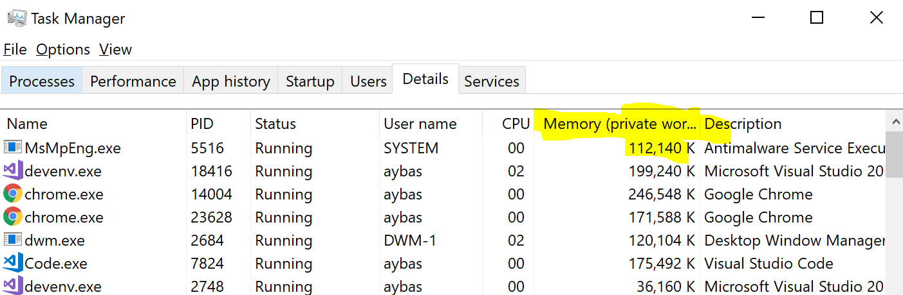
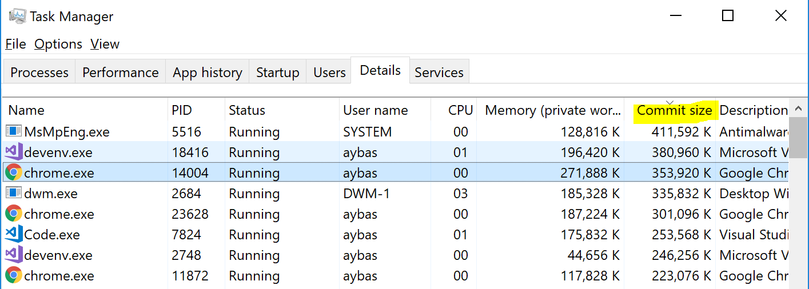
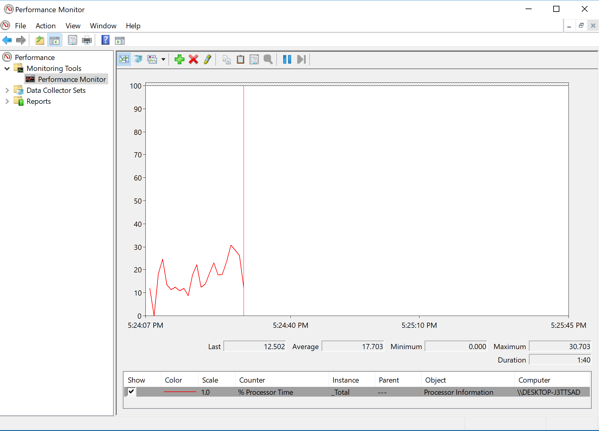
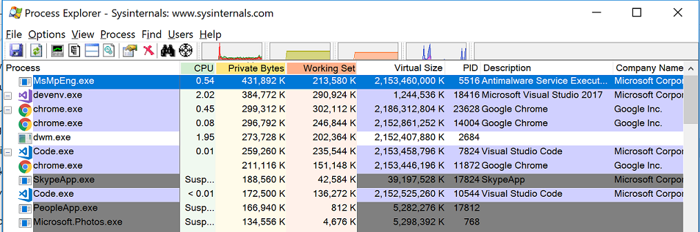
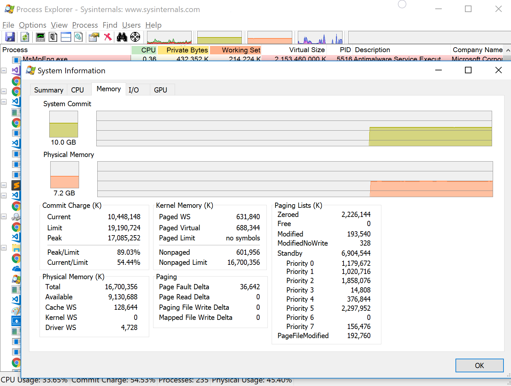

\[Disclaimer: This post was edited in Feb 2022 to address feedback. Previous version can be found on Github\]

As a windows user for many many years, Task Manager is a friend. Through the years, I have used it to kill thousands of misbehaving applications, and getting info about which ones are exhausting my resources. Until I started working with machines that have  100+ of GBs of memory hosting data-intensive services, that's when I first started seeing discrepancies between how much memory my app was allocating vs what Task Manager shows. In this post I will discuss how Task Manager can be lacking as a memory tracker, and go over alternatives that could replace it. First, let's discuss how memory allocations work in Windows.

- [Allocations in Windows](#allocations-in-windows)
  - [Reserving vs Committing memory](#reserving-vs-committing-memory)
  - [OS Paging](#os-paging)
- [Memory Tracking](#memory-tracking)
- [Effective Memory Metrics](#effective-memory-metrics)
- [Debugging with Memory Info](#debugging-with-memory-info)

tl;dr: Task Manager hides info about process's Paged Memory and does not have a way to show its Virtual Space. `Process Explorer` is a better alternative for in-depth tracking.

## Allocations in Windows

Whenever a new process starts, OS reserves some memory space for this process's use. In x86 systems, this space is 4GB, with 2GB for kernel use, and the rest for the process. For x64-systems, reserved process memory can grow to a whopping 64TB. How come can we reserve up to several TBs when we actually have a measly 32GB RAM? We'd need first to understand reserving vs committing memory.  

### Reserving vs Committing memory

Not all parts of that huge address space are "usable". Only a tiny fraction of the Process Address Space is backed by either physical RAM, or by disk (explained [below](#OS-Paging)). Memory that is backed is referred to as `Committed`. Memory otherwise, and that's the vast majority of a process's address space, is either free or `Reserved` memory. In C++, reserving a piece of memory can by achieved through a call to [VirtualAlloc](https://docs.microsoft.com/en-ca/windows/win32/api/memoryapi/nf-memoryapi-virtualalloc?redirectedfrom=MSDN) with the `MEM_RESERVE` flag. Committed memory is then the actual resource limit in the OS, since it's backed by hardware. Let's give it a look.

### OS Paging

OS Paging is an amazing concept. Basically, the OS *realizes* that some parts of the memory are not used a lot by your app. Now, why waste precious physical memory on that? The kernel moves this unused space from RAM to disk. Once it gets accessed again, it gets brought back into RAM. Another use for paging is when the system runs out of free RAM, but some process needs more memory, in which case the OS can try and free up some RAM by moving it to the disk. 

For a more detailed explanation of how memory works in windows, I cannot recommend enough Mark Russinovich's [Mysteries of Memory Management Revealed](https://www.youtube.com/watch?v=TrFEgHr72Yg).  

## Memory Tracking

Now that's a lot of info, whom to turn to to understand process memory details? of course it's Task Manager!

Memory that is backed by RAM is generally referred to as `Working Set`, while `Private Bytes`, in general, are the overall committed memory. Dlls make definitions a little more complicated, so let's ignore them for now. In other words:

```
Private Bytes [Committed Memory] =  Working Set (RAM-backed memory) + Page File (Disk-backed memory) 
```

By default, Task Manager shows Working Set under any process:



And that's the number I used to look at all the time. Now, I understand that it says that in parentheses, but I still find it easy to miss, especially for someone (as I was) unaware of all these memory terms; (private) Working Set, Private Bytes, Reserved Set, etc, but wondering where did his allocated bytes go. To my surprise, Task Manager *actually* has info on process total commit size, but it's under the column `Commit Size`. So far, I could not find Virtual/Reserve Memory info in Task Manager.


*Task Manager allows adding Commit Size by right-clicking columns and adding it*

## More Memory Meters

Thankfully, there are many other resources to examine process metrics in Windows. `PerfMon` is a Win32 app that can be used to expose very detailed info about each process and the system in general:



Interestingly, PerfMon can actually examine & compare metrics across multiple machines in the network. It's very powerful, but Task Manager IMO is more user friendly. In order to get an in-the-middle solution, I recommend [Process Explorer](https://docs.microsoft.com/en-us/sysinternals/downloads/process-explorer):



Boom! So much info! Visual Studio, why are yous till 32-bit (notice its Virtual Size)? My computer's peak memory usage has been at 89% of its limit, not too shabby. This comes in useful [later](#debugging-with-memory-info). 

## Debugging with Memory Info

This info is not just some OS trivia. It has time and time helped me debug various problems.

Most importantly, is figuring out the *untouched* parts of committed memory. The paged part of the process represents a very important piece of information: memory committed and not used frequently or rarely used.

Even if this memory is going to be used occasionally, it is important to realize that this access is going to be expensive, and doing this on the hot path is a no-no. Leaked memory should show up as part of this value too.

For this reasons, I have previously heard it suggested to remove `PageFiles` completely, effectively making `Private Bytes == Working Set`. However, it's a double-edged idea though. This renders the OS unable to discard memory for misbehaving apps, which could sometimes include OS apps allocating data not needed in memory.  