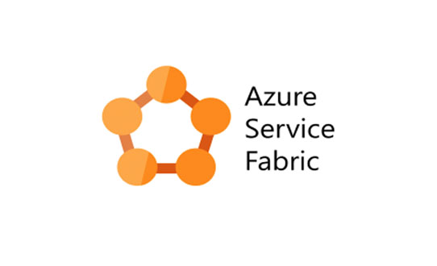
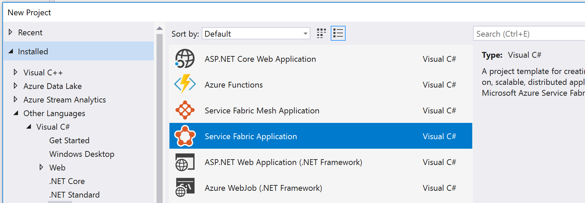
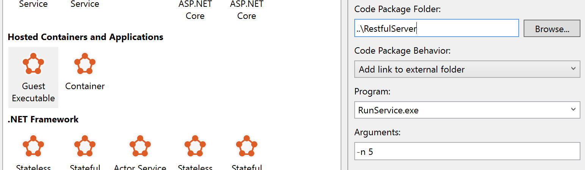
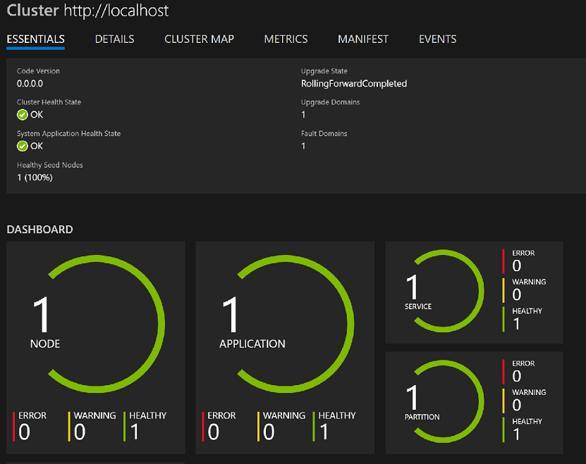
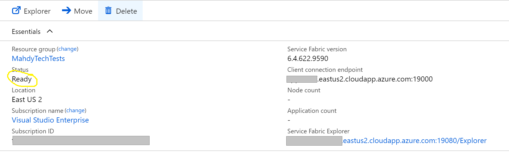
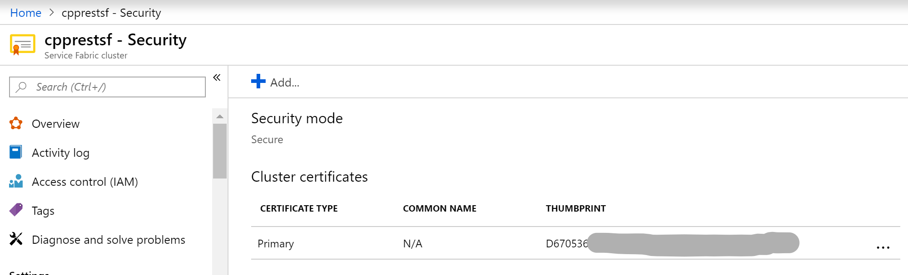
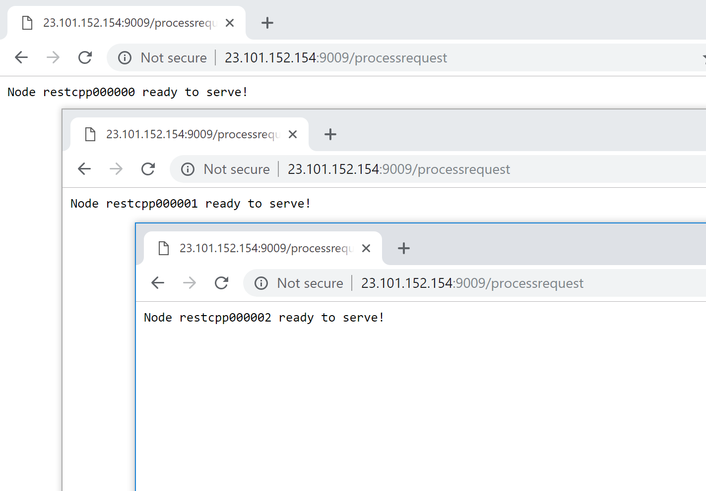

I have mostly been working on the details of rather big projects, and that can make one lose touch with end-to-end magic. This week I decided to create a very simple distributed C++ web app, running on an Azure fleet. I settled on using Service Fabric as a distributed framework and CPPREST SDK for building the C++ web server. This is how it went!

- [Service fabric](#service-fabric)
  - [How to Get it](#how-to-get-it)
  - [How to Run it](#how-to-run-it)
  - [Let's move to the cloud](#lets-move-to-the-cloud)
- [Who said C++ is ancient: CPP Rest SDK](#who-said-c-is-ancient-cpp-rest-sdk)
  - [Interlude: vcpkg](#interlude-vcpkg)
  - [A REST web server](#a-rest-web-server)
- [Putting It Together](#putting-it-together)
  - [Credentials](#credentials)
    - [Certificates](#certificates)
  - [Port Listening Error](#port-listening-error)
  - [Final Result](#final-result)
- [Last Words](#last-words)

## Service fabric



[Service Fabric](https://docs.microsoft.com/en-us/azure/service-fabric/service-fabric-overview) is an Azure distributed platform solution. It manages orchestration & packaging without the need for containerization. In other words, only binaries are provided to the framework, and it takes care of uploading them to all the machines in the [cluster](https://whatis.techtarget.com/definition/cluster) in a safe manner. Running an app on a whole fleet of VMs with several clicks is rather empowering - and Service Fabric allows for that.

Service Fabric is pretty simple to start on and has got good integration with Visual Studio. In my experience though, there are always some knobs that need to be turned before things are working as they are supposed to - more on that later.

> Note: [Kubernetes](https://kubernetes.io/) is usually [what comes to mind](https://blogs.msdn.microsoft.com/azuredev/2018/08/15/service-fabric-and-kubernetes-comparison-part-1-distributed-systems-architecture/) when Service Fabric is mentioned, as a very popular orchestrator. However, my experience with containers on windows is pretty bleak, so I went with Service Fabric.

### How to Get it

Two main steps are needed to create a Service Fabric app in Visual Studio:
- [Grab SDK ](https://www.microsoft.com/web/handlers/webpi.ashx?command=getinstallerredirect&appid=MicrosoftAzure-ServiceFabric-CoreSDK)
- Make sure Visual studio has [Azure Development](https://visualstudio.microsoft.com/vs/support/selecting-workloads-visual-studio-2017/) workload

> I recommend starting off with Visual Studio, at least to get a look at required config files and standard deployment pipeline. Later on, Visual Studio can be discarded in favor of Configs &  PowerShell scripts.

### How to Run it

Service Fabric has deep support for .Net and various web technologies, offering [stateful](https://www.bizety.com/2018/08/21/stateful-vs-stateless-architecture-overview/) services support and more. Nonetheless, C++ devs, don't despair. It still allows for a `Guest Executable` project type, where Service Fabric just needs triggering command to run the service, and that's it.




*Create a Guest Exceutable Service Fabric app in Visual Studio*

After creating the project and adding the path to binaries - running the project deploys the app to a local virtual cluster, simulating an actual cluster to a large extent. Make sure to have your Service Fabric Local Cluster manager [turned on](https://stackoverflow.com/questions/42510388/how-to-start-local-azure-service-fabric-cluster-with-powershell-or-cli) first.

The cluster manager includes the dashboard, which is pretty cool. It shows the overall metrics of the cluster. For example:



One thing to note is to `return -1;` in the failure cases. When an app ends with non-zero exit status, Service Fabric understands that the app failed and signals that to the dashboard (or any monitoring setup!).

### Let's move to the cloud

Now that we have got our local app running locally, let's move where everyone has access! Service Fabric supports on-premise (non-Azure) clusters, but for the sake of getting started, it's easier to test on Azure. Microsoft has a decent [tutorial](https://docs.microsoft.com/en-us/azure/service-fabric/service-fabric-cluster-creation-via-portal) on how to create the cluster from the Azure Portal, on top I have the following notes:

- For a first-time test, don't get the cheapest machine - [RDPing](https://support.microsoft.com/en-us/help/17463/windows-7-connect-to-another-computer-remote-desktop-connection) into that would be a nightmare. I rather recommend getting a single instance to start with but of decent perf. I got a single `DS2_v2` while doing my tests.
- After primary tests pass, you can cheapen on the model and increase the number of nodes.
- Pay attention to `Status` in the portal. It is not articulated but it's [a major indicator of what's happening](https://octopus.com/blog/service-fabric-cluster-targets#gotcha-1-the-initial-wait-time). For example, after creating the cluster for the first time, although Azure deployment shows it's done, the cluster is not actually usable until `Status` reads `Ready`.



Once Service Fabric cluster is ready, any app is publishable from Visual Studio with a couple clicks! Instead of running the project (for local publish), right-click and select Publish. Now, let's make an app to publish.

## Who said C++ is ancient: CPP Rest SDK

C++ is [not the easiest](https://www.quora.com/Why-is-C++-not-used-in-web-development) language to develop a RESTful web server. However, some tooling sure makes the job easier. [CPP Rest SDK](https://github.com/Microsoft/cpprestsdk) is a relatively new library that allows for easy out-of-the-box Server/Client RESTful communication in C++. My experience has been positive and I'd recommend checking it out.

### Interlude: vcpkg

For the longest time, consuming packages easily on Windows has been a nightmare. That is until [vcpkg](https://github.com/Microsoft/vcpkg) came to the scene. VCPkg employs a source-based package management system, incurring a rebuild every time a new library is used. VCPkg has proved itself to be quite essential for Windows users like myself. I cannot really see myself going back to consuming boost the old way - searching for binaries matching my build config, or to keep looking for that blog with the Windows patch.

For REST SDK, after [installing VCPkg](https://github.com/Microsoft/vcpkg#quick-start), I ran the following: 

```bash
vcpkg install cpprestsdk 
```

and voila! it's installed and accessible from any VS project.  Lots of ❤️ to vcpkg.

> Note: I have recently become aware of [conan](https://conan.io/) which is supposed to provide similar functionality. I am yet to try it out for myself tho.

### A REST web server

Starting a REST webserver with the sdk is pretty uneventful (as it should!), the following does the trick:

```cpp
http_listener listener(L"http://*:9009/processrequest");
listener.support(methods::GET, GetHandler);
listener
    .open()
    .then([&listener]() {std::cout<<"\nstarting to listen\n"; })
    .wait();
```

It does not get much easier than this! I have hosted [my source](https://github.com/aybassiouny/ServiceFabricRestCPP) for full implementation. `GetHandler` in its simplest form should return a status code and a message - for example:

```cpp
void GetHandlerFunc(const http_request& request)
{
    request.reply(status_codes::OK, "Node ready to serve!");
}
```

Note that running this listener requires running the app as admin. If the setup is done successfully, `GetHandler` should run when a request is made to `http://127.0.0.1:9009/processrequest`.

## Putting It Together

Now to the interesting part: running our server on the Service Fabric fleet. After creating a service fabric `Guest Executable` project and pointing it to our binaries, there remains a couple of things to take care of.

### Credentials

As noted above, our app needs Admin Privileges to listen on the associated port (9009 in our case). [Service Fabric documentation](https://docs.microsoft.com/en-us/azure/service-fabric/service-fabric-application-runas-security)  has a nice explanation of how to set the right permissions fit for your app - I took a shortcut by giving my app admin privileges in `ApplicationManifest.xml`:

```xml
<Principals>
  <Users>
    <User Name="myLocalAccount" AccountType="LocalSystem" />
  </Users>
</Principals>
<Policies>
  <DefaultRunAsPolicy UserRef="myLocalAccount" />
</Policies>
```

> **Please don't** use this for production scenarios. It is worth to spend some time getting accurate permissions needed by the app. Unfortunately, Service Fabric is not really making this part easy.

#### Certificates

Another *nice* concept is how Service Fabric forces cluster admins and apps to use certificates to run the app on the cloud. That usually entails adding certificate thumbprint to `ApplicationManifest.xml`:

```xml
<Policies>
    ...
    <SecurityAccessPolicies>
      <SecurityAccessPolicy ResourceRef="MyCert" PrincipalRef="myLocalAccount" GrantRights="Full" ResourceType="Certificate" />
    </SecurityAccessPolicies>
  </Policies>
  <Certificates>
    <SecretsCertificate X509FindValue="<Certificate_Thumbprint>" Name="MyCert" />
  </Certificates>
```

The certificate thumbprint can be found in the portal under **Service Fabric Cluster** > **Security** >> **Cluster certificates**:



Without the right settings/credentials, apps won't be able to run on the remote cluster.

### Port Listening Error

This is kind of a side story - and the reason why this project took longer than I had expected. Initially, I had my server running fine on its own (outside Service Fabric), but does not run on Service Fabric,  either locally or on Azure. It was returning a `503 Service Unavailable` error code, and my breakpoints were never hit. It seemed like requests were not making it to the web server.

After spending some time on many false paths, this [article](https://blogs.msdn.microsoft.com/webtopics/2010/02/17/a-not-so-common-root-cause-for-503-service-unavailable/) came as a life savior.

The problem had been that I was using this line in Service Fabric to open the port:

`<Endpoint Name="HelloSFServiceTypeEndpoint1" Protocol="http" Port="9009"/>`

Which, as described in the MSDN blog, causes Service Fabric to listen on those URLs and block the CPP REST SDK from receiving those requests.  

I tried to remove the line, but this renders the respective port closed on the cluster nodes. The solution was as simple as changing the protocol from `HTTP` to `TCP`, in which Service Fabric seems to open the port, but it does not block the `http://*:9009` requests. Final config is available on [github](https://github.com/aybassiouny/ServiceFabricRestCPP/blob/master/RestCluster/ApplicationPackageRoot/HelloSFServicePkg/ServiceManifest.xml).

### Final Result

After going through all these hops, it is a pleasure to see the final result! In my case, running `http://cpprestsf.eastus2.cloudapp.azure.com:9009/processrequest` results in:



No matter how many times I see this, it is still spectacular! The time it takes from editing my code to seeing the request responded to by `N` machines is <1 minute. Although this is just a test app, the concept is pretty powerful for a test-driven world.

## Last Words

Service Fabric & C++ REST SDK got the job done, and it was a lot of fun. C++ is my favorite language. It'd be a shame if I could not spin up a 100% RESTful server whenever I wanted.

I usually work with special-purpose internal tools, so it was new for me getting out there and trying OSS replacements. I hope this article gets even more folks toying with these frameworks! Let me know your favorite non-C++ (sane?) way to spin up a distributed service.