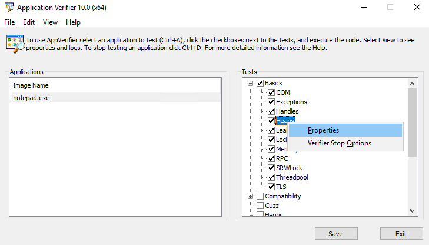

[Heap corruptions](https://en.wikipedia.org/wiki/Memory_corruption) can be nasty to investigate. I recently had to investigate a bug that manifests under special circumstances in production. Crashes had all flavors of stack traces - the trademark of heap corruption. To debug it, I ran the usually recommended tool for heap corruption: PageHeap.

## Enabling PageHeap

PageHeap is an OS flag that adds an extra special buffer after each allocation, allowing to detect instructions that overrun their buffer and signal that to an attached debugger (such as Windbg, Visual Studio, cdb). 

There used to be a separate app for that: [PageHeap.exe](https://support.microsoft.com/en-us/help/286470/how-to-use-pageheap-exe-in-windows-xp-windows-2000-and-windows-server). However, it has been [deprecated](https://blogs.technet.microsoft.com/yongrhee/2010/06/17/how-to-enable-pageheap-against-a-process-such-as-print-spooler/) in favor of two new tools: [Application Verifier](https://docs.microsoft.com/en-us/windows-hardware/drivers/debugger/application-verifier) or [GFlags](https://docs.microsoft.com/en-us/windows-hardware/drivers/debugger/gflags-and-pageheap).



Application Verifier allows specifying a set of tests to run and signal in case of error - including `PageHeap` from `Basics -> Heaps`. `gflags` can  achieve this through: `gflags /p /enable notepad.exe /full`. 

### Results

It was not very fruitful. Before applying the PageHeap, I used to get random crashes. Now, I was getting consistent crashes, **once I access already corrupted memory**. I was closer, but finding *when* the memory was getting corrupted was still some tedious debugging away. Unless ...

## Wielding Debug Builds

I had an idea. Debug builds are notoriously slow for a reason - they do too many checks, and that's exactly what I needed now. I rebuilt in debug & deployed, and voila! The app was throwing exactly where the problem was happening. The problem had to do with misuse of a custom allocator that was freeing its memory without destructing underlying objects. Later on, the kernel would [reclaim](https://mahdytech.com/2019/01/05/task-manager-memory-info/) that space, at a  random moment, and accessing that structure would trigger a crash. 

Standard library and most *well-written* library enforce debug-mode checks for insecure code. Usually, Unit Tests catch these errors, but we're not always that lucky. For example, Visual C++ does boundary checks in this constructor of `std::vector`: 

```language-cpp
template<class _Iter, class = enable_if_t<_Is_iterator_v<_Iter>>>
vector(_Iter _First, _Iter _Last, const _Alloc& _Al = _Alloc())
: _Mybase(_Al)
{	// construct from [_First, _Last) with optional allocator
    _DEBUG_RANGE(_First, _Last);
    _Range_construct_or_tidy(_Unchecked(_First), _Unchecked(_Last), _Iter_cat_t<_Iter>{});
}
```

Where `_DEBUG_RANGE` will do range checks in debug mode only. In my case, it was ref-counting checks that manifested the problem. Either way, 

## Final Words

Running an app in debug mode is not straightforward. That's especially true if there's a lot of data loading involved or the app is a memory-hungry monster, as the startup can go from 5 min to hours. Here, I would recommend separating the app from the data loading logic. 

Debug mode can be a lifesaver!