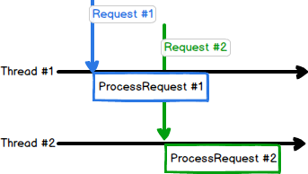
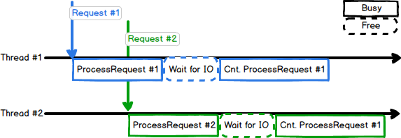
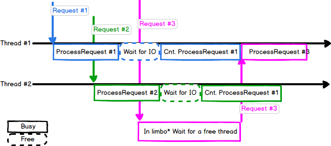
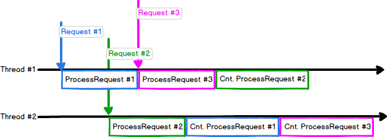

> "Everybody who learns concurrency thinks they understand it, ends up finding mysterious races they thought weren’t possible, and discovers that they didn’t actually understand it yet after all." - Herb Sutter

I was recently bitten by the pain of getting async wrong - or rather, thinking I am doing async when I was not. It was refreshing to see how fixing one bug can have a big effect on app performance. As usual in my posts - this is a server application, trying its best to perform as well as possible.

Contents:

- [Lay of the Land](#LayOfLand)
  - [Setting Number of Threads in Processing Thread Pool to a Constant](#ConstantThreads)
    - [TLS and Cold Start](#TLS)
    - [Reasoning about App Logic](#AppLogic)
- [First Try: Blocking Async](#FirstTry)
  - [Wait, What Just Happened](#WhatHappened)
- [What it Takes to be *Actually* Async](#WhatItTakes)
  - [Everything is a Callback](#ErythingIsACallback)
  - [Context Needs to be Carried Around](#Context)
- [Conclusion](#Conclusion)

## Lay of the Land

The application in hand followed a pretty straightforward pipeline for a server:

1. IO Dispatcher receives a request
2. IO Dispatcher Publishes Work to [Thread Pool](https://docs.microsoft.com/en-us/windows/desktop/procthread/thread-pools)
3. Once a thread in the thread pool is ready:
   1. Thread processes request
   2. Thread returns a response to IO Dispatcher
4. IO Dispatcher Returns Response


> Note: the separation of dispatcher and processing ThreadPool is almost always a good idea. This way, we're not blocking IO in case the processing is taking longer than it should.

For the rest of the article, I am going to ignore the IO dispatcher and focus on request processing, as this is where things are soon to get interesting. So far, the request processing has been synchronous with no blocking IO, and all in the world was good. It had a similar function signature to:

```cpp
Response ProcessRequest(Request request)
{
    RequestProcessor requestProcessor(request);
    return requestProcessor.GetResponse();
}
```

Note that `ProcessRequest` is executed in parallel by several threads in a thread pool. The number of threads in the thread pool is set to a constant number at runtime - usually equal to the number of logical cores in the server, as is [usually recommended](https://blogs.technet.microsoft.com/markrussinovich/2009/07/05/pushing-the-limits-of-windows-processes-and-threads/). For simplicity, let's suppose we are running a server with 2 logical cores. Here's request flow at this stage:



> Note that these are logical threads, not [hardware threads](https://stackoverflow.com/questions/5593328/software-threads-vs-hardware-threads).

---

Before moving on to how adding IO to request processing can make our lives harder, let's address an important point. Is setting the number of processing threads to a constant number a good idea?

---

### Setting Number of Threads in Processing Thread Pool to a Constant

This is an important detail in the design. We chose to set the number of processing threads in the thread pool to a specific number. This decision is backed by two reasons:

#### 1. TLS and cold start {#TLS}

[Thread-Local Storage (TLS)](https://mahdytech.com/2018/12/30/what-happens-when-you-press-x/#Just-don’t-bother-with-TLS) can help [alleviate heap contention](https://software.intel.com/en-us/articles/avoiding-heap-contention-among-threads) among different cores. To achieve the best performance, TLS is allocated on thread creation, which leads to experiencing cold start latency hikes (unless warmup is used).

Allocations, however, are not cheap. While it can be *okay* to have sub-par performance during warmup, arbitrary large allocations during serving are not acceptable and will lead to unwanted latency hikes. If we don't use a constant number of threads, QPS increases can trigger the pool manager to create new threads, causing latency hikes. In a perfect world, increased QPS should lead to increased CPU usage, not latency hikes.

#### 2. Reasoning about App Logic

I find it easier to reason about an app's logic when I know for sure how many threads are doing request processing. Allowing the thread pool to create & delete new threads upon need means we are never really sure how many threads are there. Scheduling, as we are about to elaborate, becomes harder. This might not be as concrete as the first reason, but it has helped a lot in many debugging sessions.

> Note: if you are using Windows thread pool, there's a nifty trick to set the number of threads to a specific number, and that is to set both the minimum and the maximum number of threads. E.g.:

 ```cpp
void SetNumberOfThreads(PTP_POOL ptpp, int numOfThreads)
{
    SetThreadpoolThreadMaximum(ptpp, numOfThreads);
    SetThreadpoolThreadMinimum(ptpp, numOfThreads);
}
```

---

At this point, the app was capable of handling 40k QPS per machine. That's not too bad. Until it was desired to add a remote call within the `ProcessRequest` pipeline.

> Note: for benchmarking throughput, I have used [Apache Benchmark](https://httpd.apache.org/docs/2.4/programs/ab.html) under Linux. For some reason, Windows version always has worse numbers. For the numbers reported here, I ran the command: `ab -k -c <concurrency_level> <endpoint> -n 1000000`.

---

## First Try: Blocking Async

Now that I needed to add the network IO call on the serving hot path, I started thinking, how to inject this into the workflow [above](#LayOfLand)? We need some way of stopping processing, do the IO, then continue after IO is done. At a first glance, it looks like a thread synchronization problem. Let's consult what C++ has to offer.

Suggestions for thread synchronization are almost always around using a `std::promise` and `std::future` combo in order to achieve synchronization between different threads. Visiting back our `ProcessRequest` code sample above, and applying suggested primitives, the function has evolved to:

```cpp
Response ProcessRequest(Request request)
{
    std::promise<IOResult> promise;
    std::future<IOResult> fut = promise.get_future();
    DispatchIOAsync(promise);
    auto ioResult = fut.get();
    RequestProcessor requestProcessor(request, ioResult);
    return requestProcessor.GetResponse();
}
```

It was easy to add, and we didn't have to change a lot of code. Great! it also totally does **not** work, perf-wise. With those added 3 lines of code, we now go from 40k QPS all the way down to 8k QPS!

### Wait, What Just Happened

Let's take a second and reason about this. We have added an extra IO operation, which is a remote call to another machine. Hence, the majority of the added work is not done locally, but on another machine and (more importantly) in transport. Why did we lose so much throughput then? To visualize the issue, let's have a look at how our threads work now:



Now, what if a 3rd request comes along?



*this limbo is the interval between submitting work to the thread pool, and a thread becoming ready to process this work.

And this limbo is exactly why throughput had plummeted. The decisions to limit the number of threads & using *IO Waits* have come together to rack up our request waiting queue while other threads are just waiting for IO.

> Side note on the performance of waits: I used to be under the impression that waits, such as `std::future::get()` are part of the cause for perf degradation, due to OS context switching to check if the condition has been satisfied or not. Upon doing a bit of homework, turns out OS actually does a good job with locks and IO waits. Waiting threads are kept waiting, until another thread signals that occurrence of the waited-for event, at which case the scheduler [boosts](https://docs.microsoft.com/en-us/windows/desktop/procthread/priority-boosts) the waiting threads' priority to make sure they get picked up soon after.

## What it Takes to be *Actually* Async

Doing IO within the hot path is an inevitable evil. CPUs are just faster. Which means, while IO is happening, CPU would just be sitting there, doing nothing. Unless we give it some work!

Following the same request flow model from above, our goal is to achieve something close to:



To put it in words, we'd like to replace wait time by actually doing some work. This is achieved through [Cooperative Scheduling](https://luminousmen.com/post/asynchronous-programming-cooperative-multitasking). Basically, instead of thread `T1` waiting for an IO to end then execute a function `foo`, we pass `foo` as a callback to the IO call and ask the dispatcher to execute this callback once IO is done. Now, `T1` is free to handle more requests with no wait.

Unfortunately, achieving this is not straightforward. Two major changes need to be applied:

### 1. Everything is a Callback

We cannot have functions with the signature `Response ProcessRequest(Request request)` anymore. These need to be overhauled, and replaced with:

```cpp
using ResponseCallback = std::function<void(Response)>
void ProcessRequest(Request request, ResponseCallback callback);
```

Note how the return type `Response` got transformed into an input parameter in the callback `std::function<void(Response)>`. This way, any thread can return the response, by calling the callback.

This is the biggest hurdle I had faced, as it requires changing signatures everywhere. If during design, you see doing IO on the hot path in the future of an app, I would highly recommend starting off with signatures supporting callbacks. Doing that later on is painful.

### 2. Context Needs to be Carried Around

With callbacks - lifetimes become all the more difficult. Not only do objects have to live in the current parentheses context - but we have to be careful to capture them in the callback, in case they are used. For example, `Request` object from before probably needs to be kept alive until the very last callback is called.

While lambda captures and `std::function` should do a good job of keeping objects alive, I would suggest using an encapsulating context object instead of managing lifetimes one by one. In my case, I created a `RequestContext` object that encapsulated all objects need to be kept alive while serving a request.

---

With the last two points in mind, our prototype now becomes:

```cpp
void ProcessRequest(Request request, ResponseCallback callback)
{
    auto requestContext = std::make_shared<RequestContext>(request);
    auto ioCallback = 
        [requestContext = std::move(requestContext)]
        (IOResult ioResult)
    {
        RequestProcessor requestProcessor(std::move(requestContext), std::move(ioResult);
        callback(requestProcessor.GetResponse());
    };

    DispatchIOAsync(ioCallback);
}
```

After applying similar changes, the app was back on track. Latency stayed the same, but throughput under high concurrency levels could now reach about 30k QPS!

---

## Conclusion

The major defining factor here has been our static number of processing threads in the thread pool. Adding more threads might have solved the problem, but I would argue against that. It would be hard (and hardware dependent) to find the best number. We have already discussed setting that [dynamically](#TLS).

Cooperatively-scheduling our threads to yield on IO blocks allow us to process much more requests per second, with no reprimands for latency. Nonetheless, It is unfortunate that there is no standard support yet to make this process easier. [Coroutines](https://stackoverflow.com/questions/43503656/what-are-coroutines-in-c20) are promising, and although they are not standardized yet, they already have MSVC and Clang implementations.

Let me know what you think [@aybassiouny](https://twitter.com/aybassiouny)