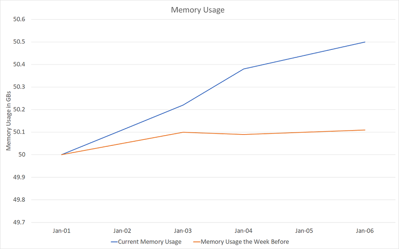
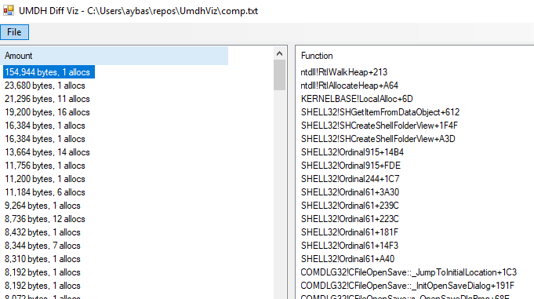

> This language is lacking  
In garbage collecting  
So now I’ve got a memory leak  
["Memory Leak"](https://awesomeinquotes.com/track/memory-leak) by Awesome

If you manage memory on your own, it is almost inevitable that some code, at some point, will mismanage memory. Memory leaks are one type of this mismanagement. They show the app allocated memory, but forgot to deallocate it.

It is good to have an approximate idea how much memory an app is expected to use. This way, when the app misbehaves, we can refer to that baseline and measure the impact. Once a regression is confirmed, the tough task now is to investigate which part of the code caused that - and fix it. In my experience, finding memory bugs is orders of magnitude harder, than the eventual fix that, in many occasions, is a one-liner.

- [Backdrop](#backdrop)
- [Sure XPerf's Got it](#sure-xperfs-got-it)
- ["User Memory Heap Dump" (UMDH) For the Rescue](#user-memory-heap-dump-umdh-for-the-rescue)
  - [So, What's UMDH](#so-whats-umdh)
  - [How to Run it](#how-to-run-it)
  - [Interpreting UMDH Output](#interpreting-umdh-output)
- [What happened next](#what-happened-next)
- [Conclusion](#conclusion)

## Backdrop

One day, I found out one of my services, running in a cloud cluster, is using a couple hundred MBs more than expected. There was one issue that differentiated this from a standard memory leak: the leak took place excruciatingly slowly:



Note how the issue only materializes several days after running without restart, and even a week after, it only accounts for a 400 MB leak, a measly 1% of total app memory usage. (From here on, I refer to memory usage and [private bytes](https://mahdytech.com/2019/01/05/task-manager-memory-info/) interchangeably).

> Note: fluctuations in memory at the healthy state the week before - the orange line - are caused by cache saturation and data reload. This does not make leak detection any easier as what looks like a leak might just be a heavier-than-usual data drop.

## Sure XPerf's Got it

XPerf is the first tool my hand goes for, but it didn't work here. Ever tried to run an ETW capture for one hour? Probably not - because it is humongous. An hour under high QPS guarantees a file that is almost impossible to analyze or copy around in raw format. Even then, with the snail-paced leak at hand, one hour might not be enough. It could have too many false positives to judge where the leak is coming from.

> Note: [peteronprogramming](https://peteronprogramming.wordpress.com/2017/11/01/compressing-etl-etw-output-files/) has a rather interesting work to improve on XPerf's compression and file size overall. I am yet to try it myself, but let me know if you have!

XPerf probably could have gotten the job done, *eventually*. It has got great tools for heap analysis, and I am sure to cover it in a future post. For the case in hand though, it would not have accomplished the job efficiently enough. Note that a [circular buffer](https://social.msdn.microsoft.com/Forums/vstudio/en-US/c4801701-2fd8-428d-9d53-747d8e24ace5/how-to-use-xperf-in-buffering-mode-to-take-last-events?forum=wptk_v4) would not work for this too. While a circular buffer allows to limit the captured ETW log size, there is no way to know for sure that the past 10 minutes contained a significant lead to the leak.

## "User Memory Heap Dump" (UMDH) For the Rescue

Slow leaks are harder to catch using XPerf, because of the enormous generated files. That's where UMDH shines best: it's considerably lightweight to run over vast periods of time (think days). To achieve that, it provides *just* enough information to diagnose a leak: how big were allocations that never got deallocated & their callstack.

### So, What's UMDH

[User Memory Heap Dump](https://docs.microsoft.com/en-us/windows-hardware/drivers/debugger/umdh) is a tool by Windows that attaches to alloc/dealloc functions in the heap manager, and [records](http://webcache.googleusercontent.com/search?q=cache:RNHg5CsRe9AJ:www.nynaeve.net/%3Fp%3D209+&cd=7&hl=en&ct=clnk&gl=ca) when a specific process calls those functions. It is possible to take snapshots of this recording, and diff those snapshots. The workflow of UMDH boils down to:

1. App starts up and allocates uninteresting stuff*

2. We trigger first snapshot using UMDH before interesting stuff (leak) is expected to take place

3. We wait (hours or days!). Once we are fairly confident leak has happened, we take a second snapshot

4. We diff those snapshots. UMDH will show allocations that took place between first and second snapshot.

*Note that if the leak happens on startup, it is possible to take just one snapshot, with no need for diffs. For startups leaks, however, XPerf might be a more suitable tool.

### How to Run it

In order for `UMDH` to be effective, we need to turn on the global flag [Create user mode stack trace database](https://docs.microsoft.com/en-us/windows-hardware/drivers/debugger/create-user-mode-stack-trace-database):

```bash
gflags -i <process_name> +ust
```

Then, we restart the target process if it is already running. We can *dump* **snapshots** of this recording through:

```bash
umdh -pn:<process_name> -f:<dump_text_file>
```

Don't forget to direct the environment variable `_NT_SYMBOL_PATH` to correct symbol resolution stores, otherwise stacktrace will be much less useful:

```
set _NT_SYMBOL_PATH=SRV*d:\symbols\*http://msdl.microsoft.com/download/symbols;
```

### Interpreting UMDH Output

UMDH, although powerful in its own context, could definitely borrow a little brush up for its output from [WPA](https://mahdytech.com/2019/01/13/curious-case-999-latency-hike#XPerf). The logged file is basically a list of allocations:

```bash
30 bytes + 30 at 206EDDA8BA0 by BackTraceEDD4EEA6
	7FFE82352933
	7FFE8226DA74
	7FFE822AD412
	7FFE822AD2FA
	7FFE822AD0FA
	7FFE7EDC7CAD
	7FFE70A8CA10
	7FFE70A95B63
	7FFE70A61109
	7FFE7F6CA6B3
	7FFE70A95E20
```

A list of single allocations is not useful. To decipher it we need to run:

```bash
umdh <snapshot_1> <snapshot_2> <analysis_log>
```

And the last step produces the analysis log we need:

```bash
....
+  154944 ( 154944 -      0)      1 allocs	BackTrace9933FD81
+       1 (      1 -      0)	BackTrace9933FD81	allocations

	ntdll!RtlWalkHeap+213
	ntdll!RtlAllocateHeap+A64
	KERNELBASE!LocalAlloc+6D
	SHELL32!SHGetItemFromDataObject+612
	SHELL32!SHCreateShellFolderView+1F4F
	SHELL32!SHCreateShellFolderView+A3D
	SHELL32!Ordinal915+14B4
	SHELL32!Ordinal915+FDE
.....
```

Additionally, UMDH [visualization tool by Nettention](https://github.com/Nettention/UmdhViz) provides a great way to visualize analysis log:



See, `UMDH` becomes most useful in comparison mode, where multiple **snapshots** (starting point and endpoint) are captured and diff'd into an analysis log containing the allocations happening in between. This was immensely helpful in my case - I am not interested in the first 50 GB of expected allocations, but the unexpected extra 200 MBs.

## What happened next

With UMDH under my belt, the rest was straightforward. I ran it and took two snapshots, one after app startup and stabilizing of cache, and another **one day** later. The size of the log? A mere dozen of MBs! That was specially the case because allocations are produced repeatedly by the same callstacks, so only the number of allocations is increasing. The offender laid there in top 5 allocation callstacks. It was a small object in a `shared_ptr` that, under special circumstances, gets a circular dependency on another `shared_ptr`. 

## Conclusion

UMDH has a tightly stripped-down version of XPerf's extended heap capturing capabilities. While not nearly as powerful, in several scenarios it is good enough.

Note that `UMDH` might **not** be of use if you can't restart the process to enabling the user-mode callstack capture. For example, if the issue at hand happens rarely or is hard to reproduce, live debugging or XPerf might be a better idea.