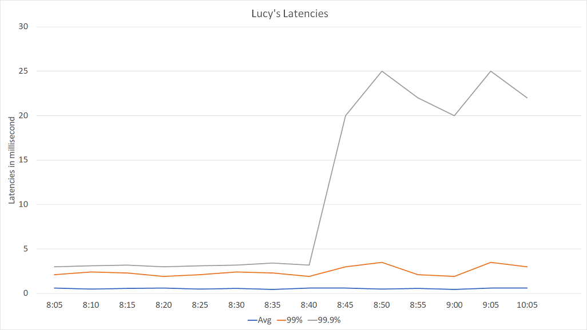
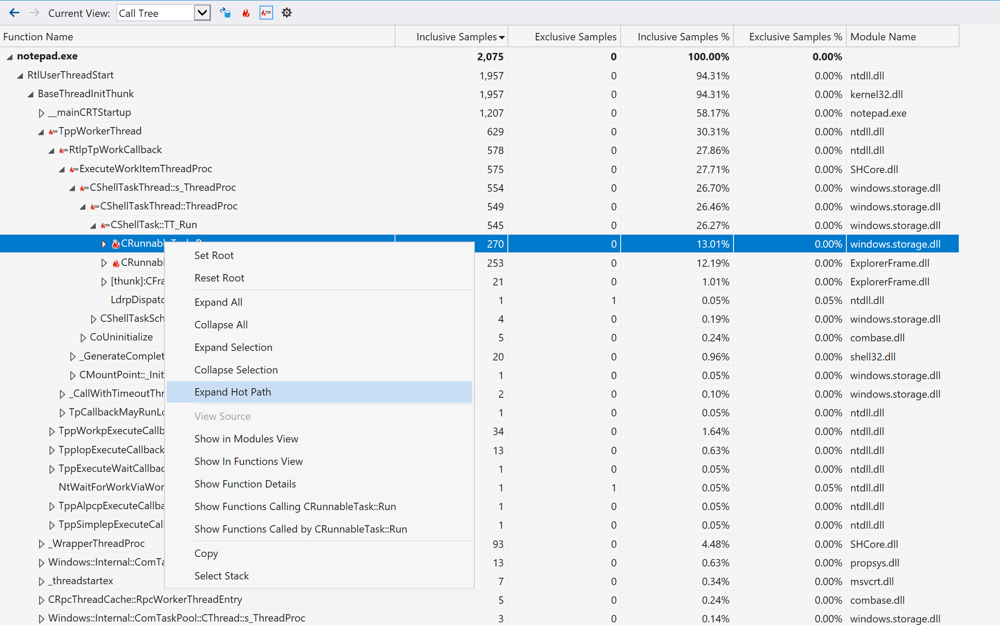
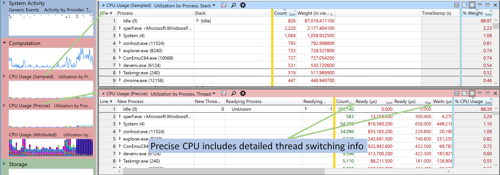
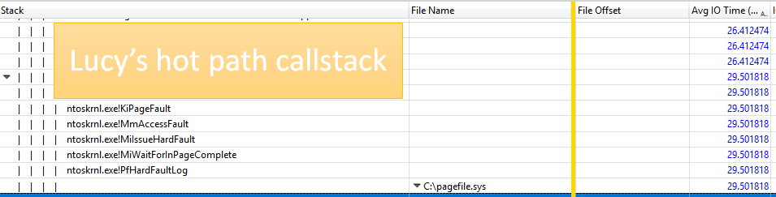
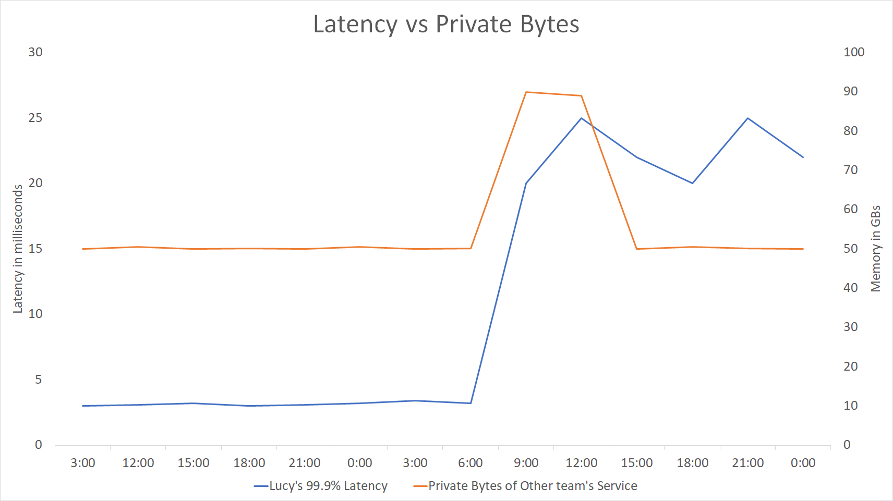
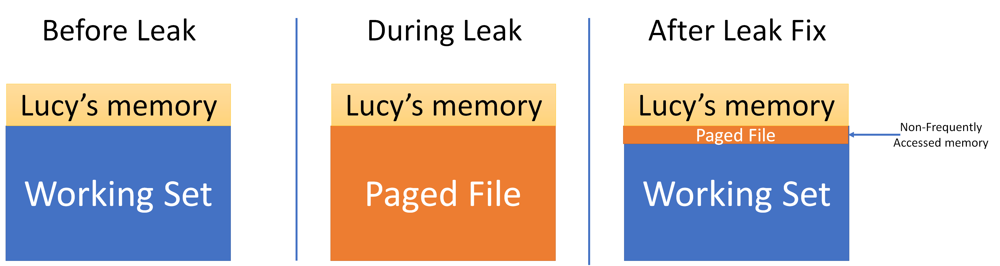

> Disclaimer: This is a story from production. I have changed a couple of details, but the gist of the story holds.

## Exposition

On a normal morning, I was checking up on health metrics of a bunch of services, when a new service under test caught my attention. Let's call this service `Lucy`. `Lucy` so far was doing pretty good perf-wise, stable latencies across the board, memory and CPU usage, all was good in the world. However, that day I found out there has been a 99.9% latency hike for several days. When I looked at latency counters it looked something similar to:



These numbers are averaged across hundreds of machines in one [data center](https://azure.microsoft.com/en-us/global-infrastructure/regions/). Also, this is a zoom-in for the problem, but let's assume that following 8:45, and for the next couple of days, [99.9% latency](https://www.elastic.co/blog/averages-can-dangerous-use-percentile) stays high.

Latency is how much time it takes `Lucy` to respond to a request, starting from the time it receives the request until it sends the response back:


That was weird for many reasons. First, `Lucy` is a new service with less than 10 [QPS](https://en.wikipedia.org/wiki/Queries_per_second) - which is very low compared to other similar services that were handling 100 QPS with less 99.9% latency. Second, `Lucy` has been doing a pretty standard distributed load: receive N documents, divide them between processing threads, do a data lookup or two, and return processing result. For the load done, we had expected less than 5ms end-to-end latency, which was the case up until 8:45.

When any `Lucy` instance is restarted, the problem *goes away*, and latency is back to normal. But we could not ship `Lucy` this way: what if this happens in production when we have 10x more QPS? We had to figure this out sooner than later.

Another interesting part, this problem occurred in *only one* data center. Other data centers were fine. This excludes issues where a change is rolled out to all machines at the same time - whatever caused this was local. However, we had done nothing! `Lucy` had no new deployments for some time, no new data, nothing! **How can nothing trigger something?**

## Let's Debug this

Naturally, I emptied my schedule, fired up the coffee machine, and dug in.

### F1 Profile

First thing I did was running a profile using [F1 Profiler](https://docs.microsoft.com/en-us/visualstudio/profiling/how-to-install-the-stand-alone-profiler?view=vs-2017). The profile is usually useful for showing CPU hot spots. Its ease of use and its lightweight report makes it usually my first tool to run unless there are clear signs for other root causes, which I didn't have by then. I ran something close to:

```batch
vsperf /attach:Lucy.exe /file:LucyProfile.vspx
sleep 5m
vsperf /detach
vsperfreport /symbolpath:"srv*d:\symbols*https://msdl.microsoft.com/download/symbols;" /summaryfile /packsymbols LucyProfile.vspx
```

Basically, attaching to the process for a 5 min, detach, then finally `vsperfreport` is used to add needed [symbols](https://docs.microsoft.com/en-us/windows/desktop/dxtecharts/debugging-with-symbols) for the report. The resulting `.vsps` file can be opened using F1 Profile tools (or Visual Studio if it was used for capture). A typical CPU profile looks like this:



*My favorite feature in F1 over XPerf: `Expand hot path`. Bonus points if you can guess which famous windows app in the preview!*

The profile didn't show anything unusual taking over the CPU. Even when I did a profile on a healthy machine, the two profiles looked very similar. I decided to move on.

### XPerf

Next, I ran XPerf, the swiss army knife of live profiles. XPerf has the big advantage of being non-invasive as it has almost negligible effect on perf of running apps. It is highly customizable but suffers from a pretty steep learning curve. [randomascii](https://randomascii.wordpress.com) has been an excellent up-to-date XPerf resource, I highly recommend the blog. I also recommend [Inside Windows Debugging](https://www.amazon.com/Inside-Windows-Debugging-Practical-Strategies/dp/B00D46F9IU) that dissects XPerf and puts the reader on track for using XPerf proficiently.

> *Note*: XPerf seems to have been rebranded to [Windows Performance Toolkit (WPT)](https://docs.microsoft.com/en-us/windows-hardware/test/wpt/), and it can also be downloaded from the Windows Store. I actually do *not* recommend using the `Windows Performance Recorder (WPR)` tool to record ETW traces and prefer to use the XPerf command line tool as shown below. WPR's defaults produce **massive** traces that are both inconvenient to move around and can contain too much information for a first-time user. For analyzing traces, `Windows Performance Analyzer (WPA)` is the way to go, hands down.

Now, while F1 Profiler provided [Sampled CPU](https://docs.microsoft.com/en-us/windows-hardware/test/wpt/cpu-analysis#cpu-usage-sampled-graph) info, it was time to get [Precise CPU](https://docs.microsoft.com/en-us/windows-hardware/test/wpt/cpu-analysis#cpu-usage-precise-graph) info. A `Sampled CPU` profile captures call stacks on regular time intervals (i.e. takes samples). On the other hand, a `Precise CPU` profile captures context switches across threads, and in turn helps to detect any locks or long IO waits. I ran something close to:

```batch
xperf -on PROC_THREAD+LOADER+Base+CSWITCH+DISPATCHER -stackwalk  CSwitch+ReadyThread -BufferSize 1024 -MinBuffers 512 -MaxBuffers 5120
sleep 1m
xperf -stop -d Lucy_Profile_1m.etl
```

Explanation:

1. Run XPerf and captures events, as well as call stacks, for Context Switches.
2. Keep running for one minute
3. Stop capturing events, and output captured trace into Lucy_Profile_1m.etl

> Note: in order to get a list of available [event providers](https://docs.microsoft.com/en-us/windows-hardware/test/wpt/providers), run `xperf -providers  K`. See the [docs](https://docs.microsoft.com/en-us/windows-hardware/test/wpt/stackwalk) for possible `-stackwalk` arguments.

Let's take a look at a Sampled vs Precise CPU profile in WPA:



Unfortunately, again, nothing new was in my Precise CPU run. The callstack had the usual time-wasters, but nothing special. I then tried to run XPerf with different parameters:

```batch
xperf -on PROC_THREAD+LOADER+DISK_IO+HARD_FAULTS+ALL_FAULTS -stackwalk  HardFault+PagefaultDemandZero+PagefaultHard+PagefaultTransition
```

Tat focuses more on disk issues and [page faults](https://stackoverflow.com/questions/5684365/what-causes-page-faults). But, it didn't yield anything either. What's going on?

#### *I have made a mistake in my analysis so far. Have you figured it out?*
---

## Resolution

It was the granularity! I was only capturing 1 min traces. At <10 QPS, 99.9% latency is less than 3 requests in a 5-min aggregation interval. Capturing only 1 minute of the profile can miss the actual problem - and it did.

This was solved by running another 10-min disk-focused XPerf. And lo and behold, the bad guy! A couple of hard faults:



The case is not actually solved yet! What caused those hard faults out of the blue? Nothing indeed had changed in `Lucy`. I had already checked `Lucy`'s memory graphs, which although pointing to a decrease in Working Set size, didn't provide a clue for the trigger. But now that I know `Lucy` got swapped out, I suspected *another* process was responsible.  This time, I checked the whole ecosystem, and the culprit stood out:



`Lucy` was not alone. *Another team's* service also lives there - and theirs had a memory leak around the same time the 99.9% latency hiked, as the graph shows. When there's a memory leak, and the kernel runs low on available physical memory, [it tries to free up memory by paging other services](https://mahdytech.com/2019/01/05/task-manager-memory-info/). In this scenario, `Lucy` was the victim and most of its working set was written to the page file.

The other team quickly realized and fixed the issue - but **they did not tell us**. Shortly after the fix, most of `Lucy`'s paged memory was swapped back into its working set - but not all of it. Some parts were not accessed frequently, and the Kernel decided to leave them paged. However, 2 or 3 requests every several minutes needed to access that paged memory. Those couple of requests experienced [hard-faults](https://www.brighthub.com/computing/windows-platform/articles/52249.aspx) and that in turn hiked the 99.9% latency.



After I realized the leak, I emailed the other team asking them, and they confirmed that was actually the case, but "Not to worry, *it is all solved now*".

It is interesting to note if `Lucy` was getting more QPS, the kernel would have probably swapped the rest of its paged memory back into the working set, and this problem would not be there. In a sense, having less load has caused the latency issues. The good news is, this was not a problem to be worried about in production, and once we restarted all `Lucy` instances, the issue was mitigated for good.

I learned so much while debugging this issue - and had a lot of fun! I think there are a lot of takeaways, especially how lack of communication can trigger such a series of events. Let me know your thoughts in the comments!