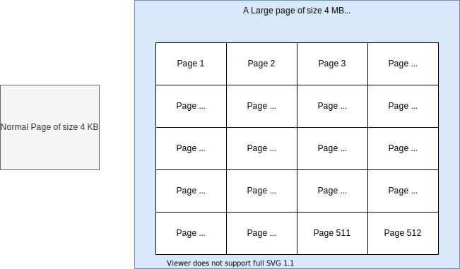
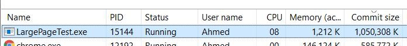
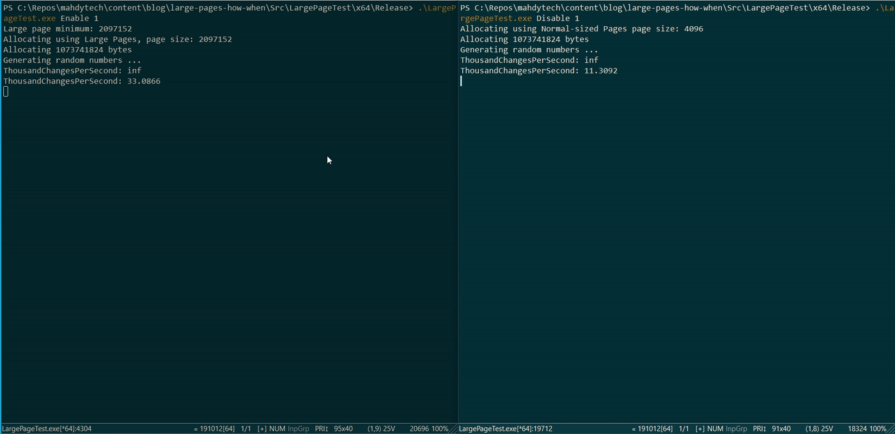

---
title: "Large-Pages in Windows: The What, the Why & the How"
date: "2020-12-27T12:00:32.169Z"
description: It hit me that I don’t know what Large Pages really are, and I needed deeper info - which I am going through in this post.
seotitle: Large Pages memory accesses Page Table lookups Translation Looksaside Buffer
socialPic: LargePage.PNG
featuredImage: LargePage.PNG
---

I stumbled across the concept of "Large-Pages" several times, mainly through mentions in our codebase, but I never went much further than exploring the wikipedia page. I knew they can make memory lookups faster, but that's about it. 

Recently, I had a service that was not doing any disk lookups, and bottlenecked on a bunch of memory accesses that were done for each request. I thought to myself; "Easy! I will use large pages and my service will run faster". It didn't. It hit me that I don't know what Large Pages really are, and I needed deeper info - which I am going through in this post.

- [The What](#the-what)
- [The Why](#the-why)
  - [The whynot](#the-whynot)
  - [Bonus: Huge Pages](#bonus-huge-pages)
- [The How](#the-how)
  - [1. Add User Privilege `SeLockMemoryPrivilege`](#1-add-user-privilege-selockmemoryprivilege)
  - [2. Turn `SeLockMemoryPrivilege` on before use](#2-turn-selockmemoryprivilege-on-before-use)
  - [3. Use it](#3-use-it)
- [Give me the numbers](#give-me-the-numbers)
- [Last notes](#last-notes)

## The What

To start things off, what is a page? According to [Wikipedia](https://en.wikipedia.org/wiki/Page_(computer_memory)): 

> [A page]  is the smallest unit of data for memory management in a virtual memory operating system.

A page is a chunk of contiguous memory, a big array. The kernel memory manager uses the page as its smallest unit to manage. For example, when we lookup a memory address, what decides if a [hard fault](https://scoutapm.com/blog/understanding-page-faults-and-memory-swap-in-outs-when-should-you-worry) is triggered or not, is whether the *page* containing this address exists in the physical memory.

A page is of a fixed size. In Windows, that's usually about 4 KB. A `Large-Page` is, as the name suggests, of bigger size, usually 2 MB. 



## The Why

So why is it better or faster? To understand that, we first need to look into how address translation happens. 

Assume our application has a pointer that holds `0x00000085C92FFBE4` and we try dereference that location, the kernel needs translate this virtual address to a physical one in RAM (if possible). In order to do this there are two familiar ways:

  - Do the work, which involves multiple lookups in Page Table. While this may sound trivial - it is significant, considering this is done for every memory retrieval
  - Look it up from a cache (in this case the CPU's [Translation Looksaside Buffer](https://www.geeksforgeeks.org/whats-difference-between-cpu-cache-and-tlb/) cache), the far faster way

Large Pages are much more cache friendly than normal sized pages. There are fewer of them, and take a fewer number of entries to cover much more address space. This leads to a much higher probability of having their entries availailable in TLB, and in turn, faster memory accesses.


If TLB only had 5 entries, using Normal pages can only cover 5 pages (20 KB), while using Large Pages can cover up to 2560 pages (10 MB), giving a mugh higher probability for a cahce hit on a given memory access.
 

### The whynot

Large pages sound great - but why not have all allocations in large pages? They have pointy downsides: 
- Large pages are more prone to fragmentation, as they require contiguous free RAM, which might be hard to find after PC has been up for a while. 
- Large pages are harder to allocate, as they have strict requirements for allowed page range. For example, a large page can occupy the page ranges 0-511, or 512-1024, etc, but cannot occupy the pages 1-513, even if they are free, limiting our options even futher.

Allocations for large pages fail **more often than normal allocations** - and code should be written to accomodate that; e.g. performance sensitive services that require large pages might prefer to fail the node completely if that one allocation fails, until node managers restarts the machine. 

### Bonus: Huge Pages


It is possible to allocate even bigger pages - called Huge Pages, that are about 1GB. However, there is no special config for it. The memory manager will automatically use a Huge Page if allocation size is big enough, and pending memory availability with the same restrictions as [above](#the-whynot). A bigger page size allows for even less TLB entries and an even more guaranteed cache hit.

## The How

I didn't find it straightforward to setup Large-Pages, especially on my Windows Home license (which should not be much of a production issue - I hope). Let's go through the steps: 

### 1. Add User Privilege `SeLockMemoryPrivilege` 

Large-Pages [cannot be paged out](https://devblogs.microsoft.com/oldnewthing/20110128-00/?p=11643)! In other words, they always stay in RAM. Hence, the user allocating large pages needs to be have the privilege [SeLockMemoryPrivilege](https://docs.microsoft.com/en-us/windows/security/threat-protection/security-policy-settings/lock-pages-in-memory) set. Note that even an admin account might not have that privilege. Good news is, this is a one time thing that sticks across reboots. 

One way to give yourself that privilege is through Group Policy (for Home users like me, it needs to be [turned on first](https://superuser.com/a/1229992)), but it's also doable through a mix of Powershell/Win32 API:

1. Get your windows SID by running on powershell: 
```
$objUser = New-Object System.Security.Principal.NTAccount("AHMED")
$strSID = $objUser.Translate([System.Security.Principal.SecurityIdentifier])
$strSID.Value
```
2. Call `ConvertStringSidToSidA` to convert that to PSID that Win32 API regonizes
3. Call `AddPrivileges(sid, GetPolicyHandle());`, where [GetPolicyHandle](https://docs.microsoft.com/en-us/windows/win32/secmgmt/opening-a-policy-object-handle) and [AddPrivileges](https://docs.microsoft.com/en-us/windows/win32/secmgmt/managing-account-permissions) functions are provided by the docs

Code is hosted on [github](https://github.com/aybassiouny/mahdytech/pull/14/files#diff-20e3333f5c404fc51fd0d69474f6dd96fd27f55248a2edde2f6e2e43134c9618)

### 2. Turn `SeLockMemoryPrivilege` on before use

While acquiring the privilege is a once-per-user action, every process that needs to allocate large pages need to turn on the privilege first, by calling `AdjustTokenPrivileges`. This needs to be done by an admin account, however the allocation itself does not require admin privileges. 

[Github Snippet]()

### 3. Use it

A call to `VirtualAlloc` finally allocates the needed meomory: 

```
VirtualAlloc(NULL, buffersize, MEM_RESERVE | MEM_COMMIT | MEM_LARGE_PAGES, PAGE_READWRITE)
```

Note that memory allocated will be commited as well, it is not possible to just reserve a [large-page allocation](https://docs.microsoft.com/en-us/windows/win32/memory/large-page-support). 

One last note, after such memory is allocated, it's not possible to see it in Task Manager's "Memory/Working Set", and is rather viewable from "Commit Size" tab: 



## Give me the numbers 

I ran a simple experiment to see if large pages are really worth the time. I tried to simulate a memory-bound piece of code that accesses a large chunk of memory randomly. I then measured how many accesses can be done per second, when allocating the large chunk normally, vs as a large page.  


Left: Large-page enabled, right: disabled

Large page memory access are far ahead! Not really a surprise, but it's nice to see in action. Code is hosted on [github [ADD LINK]]()

## Last notes

Large Pages are especially important if you have a large chunk of memory to allocate, and access frequently. Its major downside: it's hard to allocate, and once allocated, it "sits" there in the physical memory, even if the process doing the allocating is idle, as large-page memory is non-pageable.

In case someone is wondering about the service where large pages didn't give gains at the beginning of the blog, it , turns out that this chunk was *already* getting allocated as a large-page, and my hack on top to enable it was doing nothing. The thing about large-pages - they are not very visible.