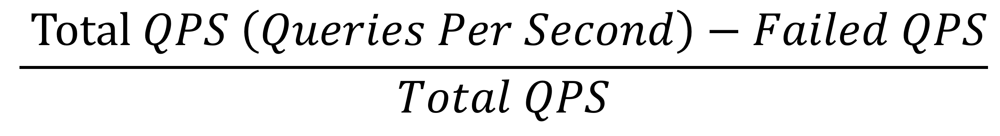
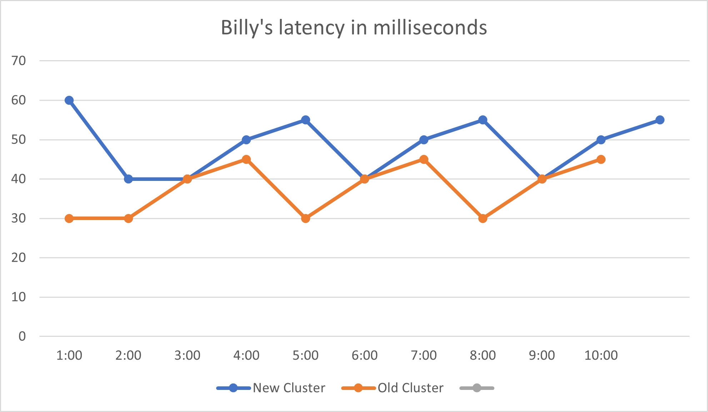
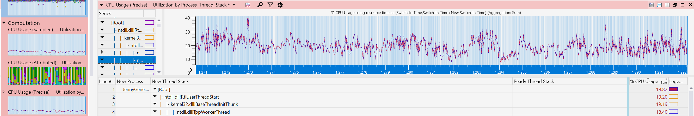
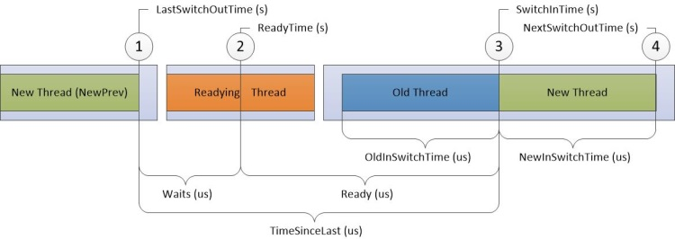
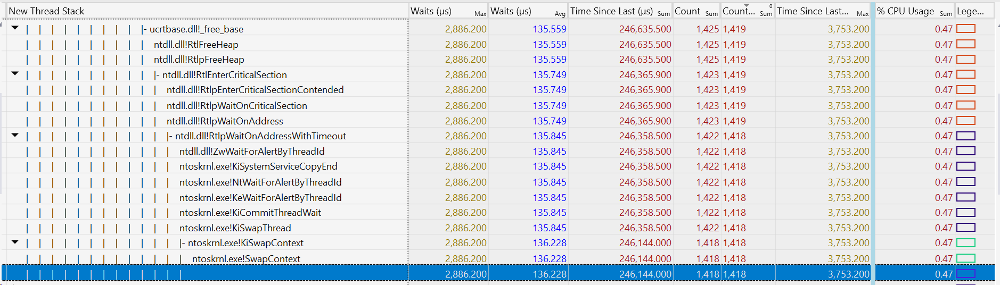
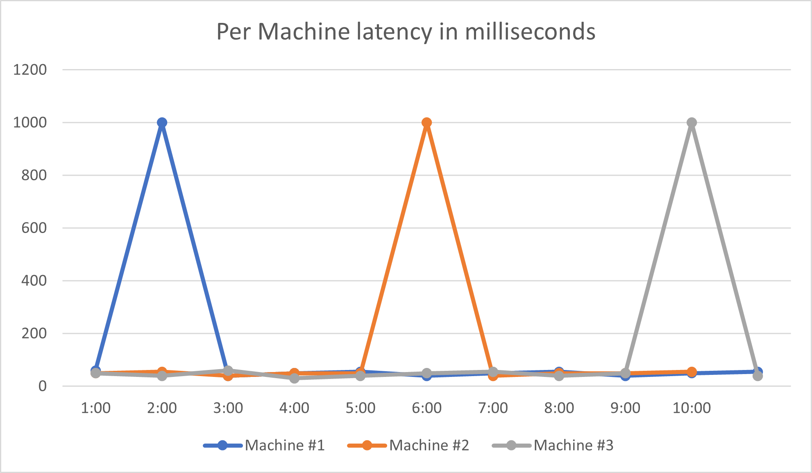
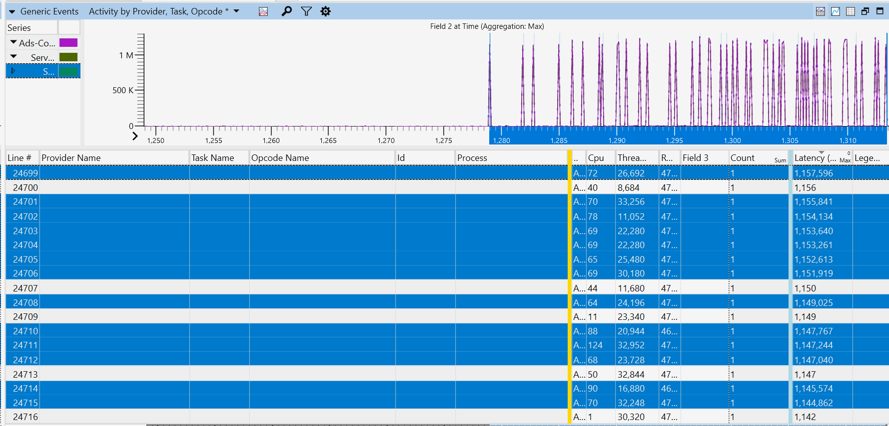
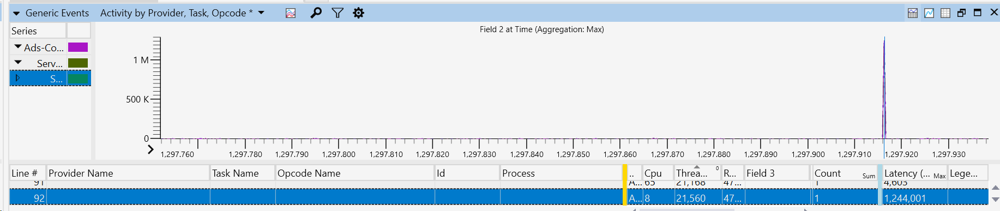
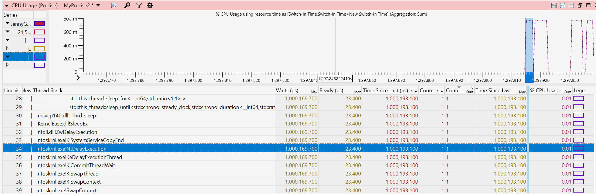
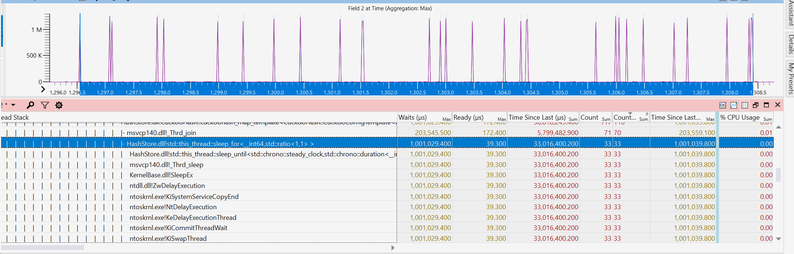

While my team was moving a service, let's call it Billy, to a new cluster with different hardware, Billy's performance degraded. Now my team knows I am into this kind of thing, so they asked me to take a look. I thought it'd be a matter of accommodating the number of threads to the new hardware, or something similarly straightforward, and said "consider it done". In hindsight, way too much confidence 😅.

- [**First things first**](#first-things-first)
- [**Digging Deeper**](#digging-deeper)
- [**Take a step back, and retry**](#take-a-step-back-and-retry)
- [**Prepare the bait**](#prepare-the-bait)
- [**Spike's in the bait**](#spikes-in-the-bait)

## **First things first**

My first move is to get a concrete idea of what kind of "perf issues" we have here. With some luck, I can find my way to Billy's monitoring graphs. My go-to graph is availability, which visualizes the equation:



There are availability [SLAs](https://en.wikipedia.org/wiki/Service-level_agreement) for all services, if availability dips below that SLA, we have got a problem. Billy's availability graph was lower than the SLA, so we've got a real problem here. There are many reasons for an availability drop – as many as the reasons a query can fail. Good client monitoring is essential to triage why we have a low availability; it could be for example a client issue or a server issue, and if it is a server issue could be due to latency or maybe the server is too busy handling other requests. In Billy's case, it was high server latency:


<center><I>Billy's latency on the cluster with the new hardware compared to the old cluster</I></center>
<br/>
I started by preparing a simple change that updated some configs (e.g. number of threads used, maximum number of requests processed at a time, etc) and hoped that would do the trick – it didn't. Latency and availability stayed about the same.

## **Digging Deeper**

In my experience, a latency regression is a sign of an introduced resource contention, 90% of the time it is heap contention during allocating or freeing memory. On Windows, this contention shows up clearly on an ETW capture. I used to use [XPerf](https://mahdytech.com/2019/01/13/curious-case-999-latency-hike/) for taking ETW captures, but now I find [WPR](https://docs.microsoft.com/en-us/windows-hardware/test/wpt/wpr-how-to-topics) more convenient, I usually suffice with the CPU events using the command:

```
Wpr -start cpu.verbose
```

The ".verbose" part is important as it means we're getting callstacks as well – hard to optimize code without knowing which line is causing the issue. I took a very brief 5 second capture (CPU.Verbose captures can quickly grow huge, especially on servers with 100+ cores), I then open the captured etl file with [WPA](https://docs.microsoft.com/en-us/windows-hardware/test/wpt/windows-performance-analyzer) on my devbox, and directly jump to the `CPU precise` events:



`CPU Precise` contains "context switching" events. These are events emitted by the kernel when threads were stopped ("switched out"), as well as when they were resumed ("switched back in"). This view relates to latency issues because, well, CPUs are fast. For my (and most) workloads, delays don't happen when CPUs are churning off work non-stop. Rather, latency delays usually happen because threads got stopped for some reason (blocks/waits or CPU starvation), and that's exactly what the "CPU Precise" events tell us more about.



<center>Anatomy of a context switch event. Source: <a href="https://docs.microsoft.com/en-us/windows-hardware/test/wpt/cpu-analysis">CPU Analysis | Microsoft Docs</a></center>
<br/>

Back to Billy's profile, I drilled down to the callstack with the highest combo of the number of waits, average wait time, as well as CPU usage. I saw that there was a lock during freeing some object that was causing a lot of threads to wait:



It looked promising so I went ahead and changed the allocator used to one that does not free its memory (albeit uses more CPU, but CPU starvation was not an issue here). I deployed my change, and tested again, and, latency was not affected 🤷‍♂️ (In hindsight the average wait in the above graph should have been  enough to hint to me that this is not it)

## **Take a step back, and retry**

My first thought was to go back to the capture and find another locking callstack to fix. But that felt don-quixote-esque. Maybe I missed something?

I had an idea - what if one machine was causing the latency issue? I went ahead and took a look at the per-machine graphs, instead of the ones earlier that are averaged across many machines:



It was not just one machine causing latency increase, it was _all_ the machines! As the graph shows, each machine _usually_ has normal latency, except once every 15-20 min it would have a crazy high spike, and come down immediately. Now that's a different beast from what I was expecting.

The ETW profile I discussed above only lasted for 5 seconds! I had an infinitesimal chance of catching what caused the spike! It might sound weird why I took such a short capture, but I usually test under more than 1-2k QPS, so in those 5 seconds I have maybe 5k or 10k requests, which is usually a good enough sample. Also, I like keeping profiles as small as possible, as that 5 second ETW profile can already inch close to 500 MBs in size.

When the problem happens once every 15 minutes, taking a 5 second profile is not going to work. I had to take a different approach.

## **Prepare the bait**

The first thing I needed to do is to make sure my captures are "circular", meaning that it would not matter how long my capture is, it would have an upper limit on file size, as newer parts overwrite older ones. Luckily, [Wprp profiles](https://docs.microsoft.com/en-us/windows-hardware/test/wpt/authoring-recording-profiles) already offer this capability, as you can specify a limit on how many buffers are used & their size, and when buffers are full the oldest events just get overwritten.

```xml
<SystemCollector Id="WPR"Name=" WPR">
  <BufferSize Value="1024"/> 
  <Buffers Value="3072"/>
</SystemCollector>
```
<center>Adding a limit of about 3 GB (3072 * 1024 kilobytes). Full wprp is <a href=https://github.com/aybassiouny/mahdytech/tree/master/content/blog/livesite-thousands-spikes/cpu.wprp">here</a></center>
<br/>

The second part was to automate stopping the capture when there's a spike. As the spikes happen every 10-15 minutes, and I can only take a maximum of ~1-1.5 minutes captures (otherwise they are too big), it became important to stop the capture right around the time a spike happens. I had my script query Billy's latency every 30 seconds, and whenever latency was extremely high (over 500ms!) it would stop the capture. After some (longer than it should) struggle with PowerShell, the final capture script looked something like:

```Powershell
Wpr -start CPU.wprp -start MyCustomEvents.wprp
While(true)
    $latency = queryLatency()
    If ($latency > 500ms)
        break
    sleep 30s
Wpr -stop big_capture_.etl
```

I then started my capture on several servers to maximize my chances, and started waiting for my bait to catch.


<center>What <a href="https://huggingface.co/">HuggingFace's</a> AI thinks "programmer fishing" looks like</center>
<br/>
After a couple of failed tries (I hate PowerShell) I finally had my capture. I opened it and verified - my capture stopped at the exact minute a latency spike had happened. I was excited! Inside this capture, I had the CPU events that covered the latency spike!

## **Spike's in the bait**

Using the "MyCustomEvents.wprp" profile above, I was also capturing events that show me latency for each request. This was very helpful, I could immediately jump to requests with the latency spike. In my capture, I found 10 requests with crazy high latencies (over 1 second) while the rest had an average of just over 5 ms. They looked promising:



Each row is a different event representing a request. You can see how latencies starting the second half are  getting very high. I picked one row (request), and zoomed in.



I then picked the thread id for that request, `21560`, and searched the thread number in the "CPU Precise" event tab. I was looking for what happened right before that thread emitted this event.



I could not believe my eyes! This thread had a 1 second wait around the same time my event was emitted, almost exactly matching the latency of this request! I looked at the callstack and saw the [dreadful call](https://en.cppreference.com/w/cpp/thread/sleep_for):

```
std::this_thread::sleep_for()
```

**Very** interesting! Some function on our hotpath is waiting for 1 second, contributing to the lion's share of this request's latency. Can this be it?

I zoomed out, and here it was! All the requests with 1 second wait coincide with a call to the 1-second sleep function call:



With a little digging, it turned out some library we're consuming decides on rare occasions to sleep for 1 second, and for some reason, this happens more often on the new machines.

Definitely one of my more interesting debugging stories :)

Please feel free to drop a comment on [hackernews]() or reach out on [Twitter](https://twitter.com/aybassiouny).
