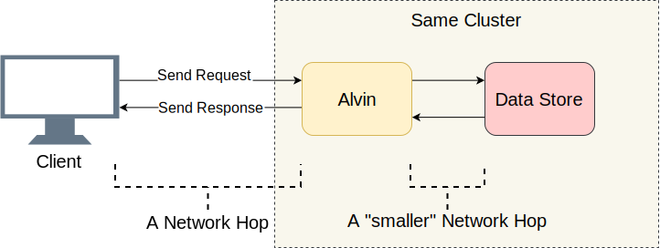

- [Backdrop](#backdrop)
- [Narrowing it Down](#narrowing-it-down)
  - [Data Store is Innocent](#data-store-is-innocent)
  - [gRPC](#grpc)
  - [Profile Cures All](#profile-cures-all)
- [More Debugging](#more-debugging)
  - [What if](#what-if)
  - [Ignite the Network Engineer Within](#ignite-the-network-engineer-within)
  - [Now, which OS are we on](#now-which-os-are-we-on)
  - [Nagle's algorithm](#nagles-algorithm)
- [Conclusion](#conclusion)

## Backdrop

As in [most posts](https://mahdytech.com/2019/01/13/curious-case-999-latency-hike/) - a distributed service was misbehaving, let's call this service Alvin. This time, I didn't discover the issue myself, it was instead reported by the team owning the client.

 One day, I woke up to a disgruntled email due to high latencies caused by Alvin, that we were planning to launch soon. In particular, the client was facing 99th latency around 50ms, way above our latency budget. That was surprising, as I have thoroughly tested this service, especially the latency - the point of complaint.

 Before declaring Alvin *testable*, I had run many experiments with 40k QPS, all showing less than 10ms latency. I got ready to reply dismissing their results. However, another look at the email showed something new: I didn't *exactly* test the conditions they mentioned, their [QPS](https://en.wikipedia.org/wiki/Queries_per_second) was much lower than mine. While I was testing with 40k QPS, they were testing with only 1k. I ran my experiment once again, with lower QPS this time, just to humour them.

Since I am blogging about this - you probably figured it out already: their numbers were correct. I re-ran my dummy client again and again, all with the same result: Lower QPS, not only leads to higher latencies, but just plain higher number of requests with latency over 10ms. In other words, if at 40k QPS 50 queries every second were over 50ms, at 1k QPS there were 100 queries every second above 50ms. Paradox!

<canvas class="js-chart" width="400" height="400" data-chart="
    {
        'data': [
            {
                'label': '500 QPS',
                'data': [3, 10, 45, 50]
            },
            {
                'label': '1k QPS',
                'data': [2, 5, 15, 30]
            },
            {
                'label': '30k QPS',
                'data': [1, 2, 3, 5]
            }
        ]
    }
    " data-labels-chart = "Avg,90th,95th,99th" data-labels-chart = "Avg,90th,95th,99th" data-yaxis-name = "Latency in Milliseconds" data-xaxis-name = "Latency Percentile"></canvas>

## Narrowing it Down

In a distributed system with many components, the first thing to do when faced with a latency issue is to shortlist the suspects. Let's dig a bit deeper into Alvin's architecture:

A good starting point is to list the IO hops done (Network calls/Disk seeks, etc), and try and figure out which one contains the latency delay. Besides the obvious IO between Alvin and its client,  Alvin is doing an extra IO step - it is calling into a Data Store. However, this Data Store lives in the same cluster with Alvin, so it should be a smaller network hop than the one between Client <=> Alvin. The following suspect list lines up:

1. Network call from `Client` to `Alvin`
2. Network call from `Alvin` to `Data Store`
3. `Data Store` disk seek
4. Network call from `Data Store` to `Alvin`
5. Network call from `Alvin` to `Client`

Let's try to strike through some names.

### Data Store is Innocent

First thing I did was converting Alvin into a ping-ping server, a server that does no request processing and once it gets a request, returns an empty response. If latency improves, then my implementation for Alvin or Data Store has a bug - nothing unheard of. This yielded the graph for the first experiment:

<canvas class="js-chart" width="400" height="400" data-chart="
    {
        'data': [
            {
                'label': 'High QPS',
                'data': [1,2,3,5]
            },
            {
                'label': 'Low QPS',
                'data': [3,10,45,50]
            },
            {
                'label': 'Low QPS (Ping Pong Alvin)',
                'data': [3,9,46,49]
            }
        ]
    }
    " data-labels-chart = "Avg,90th,95th,99th" data-yaxis-name = "Latency in Milliseconds" data-xaxis-name = "Latency Percentile"></canvas>

As the graph shows, there is no improvement when using a ping-pong server, meaning that Data Store is not contributing to the latency hike, our suspect list is shortened to half:

1. Network call from `Client` to `Alvin`
2. Network call from `Alvin` to `Client`

Great! Our list is getting quickly smaller. I thought I was almost there.

### gRPC

Now is a good time to introduce a new player to the scene: [gRPC](https://github.com/grpc/grpc). `gRPC` is an open-source library by Google for intra-process [RPC](https://en.wikipedia.org/wiki/Remote_procedure_call) communication. While `gRPC` is highly optimized and heavily adopted, this was my first time using it on scale, and I was expecting that my usage was not optimal - to put it mildly.

Having `gRPC` on board introduced a new question: is it my implementation, or is `gRPC` causing the latency problem? A new suspect is added to the list:

1. Client calls into `gRPC` library
2. `gRPC` library on the Client performs a network call into  `gRPC` library on the Server
3. `gRPC` library calls into `Alvin` request processing callback (A no-op in the case of ping-pong server)

To have an idea what the code looked like at this point, my Client/Alvin implementation did not look much different from client/server [async examples](https://github.com/grpc/grpc/tree/v1.19.0/examples/cpp/helloworld).

> Note: The list above is a bit of a simplification, since `gRPC` gives consumers power (boilerplate?) of using their own threading model resulting in an intertwined execution stack between `gRPC` and consumer implementation. Let's stick with this model for the sake of simplicity.

### Profile Cures All

After striking out `Data Store` I had thought I was almost done. I figured: "Easy! I will take a profile and find out which part is causing the delay". I am a [big fan of precise profiling](https://mahdytech.com/2019/01/13/curious-case-999-latency-hike/), because CPUs are blazing fast, and most often they are not the bottleneck. The CPU having to stop processing to do something else is what brings about most delays. Precise CPU profiling is made just for that: it has an accurate record of all [context switches](https://www.tutorialspoint.com/what-is-context-switching-in-operating-system), and in so an idea of where delays are.

I took four profiles: one under high QPS (low latency), and one with ping-pong low QPS server (high latency), on both the client and server sides. And just for the heck of it, I also took a sampled CPU profile. When comparing profiles, I usually look for an abnormal callstack. For example, the bad side with high latency showing a lot more context switches (10x or more) than the good side with low latency. But what I found was an almost matching context switching between good and bad runs. To my dismay, however, nothing of substance was there.

## More Debugging

I was getting desperate. My toolbox was empty, and my next plan was to basically wing it, iterating over experiments rather than diagnosing the problem.

### What if

From the start, the 50ms latency number has been bugging me. 50ms is *a lot* of time. I decided that my goal is to keep cutting pieces from my code until I can figure out which part is exactly causing this error. Next came the experiment that worked.

It was pretty simple, and hindsight is 20/20 as usual. I placed my client in the same machine as Alvin, and sent the request to `localhost`. And the latency increase was gone!  

<canvas class="js-chart" width="400" height="400" data-chart="
    {
        'data': [
            {
                'label': 'High QPS',
                'data': [1,2,3,5]
            },
            {
                'label': 'Low QPS',
                'data': [3,10,45,50]
            },
            {
                'label': 'Low QPS (Ping Pong Alvin)',
                'data': [3,9,46,49]
            },
            {
                'label': 'Low QPS (Localhost Client)',
                'data': [0.8,1.7,2.5,4.5]
            }
        ]
    }
    " data-labels-chart = "Avg,90th,95th,99th" data-yaxis-name = "Latency in Milliseconds" data-xaxis-name = "Latency Percentile"></canvas>

Something was wrong with the network.

### Ignite the Network Engineer Within

I have a confession: my networking knowledge is abysmal, relatively to how much I deal with networks on a daily basis. Usually I'd say that's to show how good abstraction layers work. However, network was the suspect #1, and I needed to learn how to debug that.

Fortunately, internet is kind to those wanting to learn. A combination of ping and tracert seemed like a good enough start for debugging network transport issues.

First, I ran [PsPing](https://docs.microsoft.com/en-us/sysinternals/downloads/psping) and targeted the TCP port Alvin was listening on. I used default parameters - nothing fancy. Despite running over a 1000 pings, I didn't see any of which exceed 10ms, except for the first one for warmup. This contradicts the observed 50ms 99% latency increase, we should have seen about one 50ms request for each 100 requests sent.

Then, I tried [tracert](https://support.microsoft.com/en-ca/help/314868/how-to-use-tracert-to-troubleshoot-tcp-ip-problems-in-windows), maybe there was an issue with one of the hops requests were hitting on the way between Alvin and the client. However,  tracert came back empty-handed.

So, it was not my code, gRPC implementation or the network causing the delays. I was starting to get worried I am never going to figure this out.

### Now, which OS are we on

`gRPC` is widely adopted on Linux, however its Windows adoption is not even close. I decided to run the experiment that worked: I spun a Linux VM and compiled Alvin for Linux, and deployed it.  

<canvas class="js-chart" width="400" height="400" data-chart="
    {
        'data': [
            {
                'label': 'Low QPS Baseline',
                'data': [3,10,45,50]
            },
            {
                'label': 'Windows Sample',
                'data': [3,9,46,49]
            },
            {
                'label': 'Linux Sample',
                'data': [1,1.7,2.6,4.6]
            }
        ]
    }
    " data-labels-chart = "Avg,90th,95th,99th" data-yaxis-name = "Latency in Milliseconds" data-xaxis-name = "Latency Percentile"></canvas>

Lo and behold: Linux ping-pong server didn't have the latency issues of its Windows peer, despite using my source being the same. `gRPC`'s Windows implementation had a problem.

### Nagle's algorithm

All along, I had thought I was missing a `gRPC` flag, now I realized it might actually be `gRPC` that was missing a Windows flag. I searched an internal RPC library that I knew to behave well for all the [Winsock](https://docs.microsoft.com/en-us/windows/desktop/winsock/windows-sockets-start-page-2) flags it set. I then went ahead and added all of them to gRPC, and deployed Alvin on Windows, and that fixed Windows ping-pong server!  

<canvas class="js-chart" width="400" height="400" data-chart="
    {
        'data': [
            {
                'label': 'Low QPS Baseline',
                'data': [3,10,45,50]
            },
            {
                'label': 'Windows Sample',
                'data': [3,9,46,49]
            },
            {
                'label': 'Linux Sample',
                'data': [1,1.7,2.6,4.6]
            },
            {
                'label': 'Windows Sample With Winsock Flags',
                'data': [1.1,2.2,3,5]
            }
        ]
    }
    " data-labels-chart = "Avg,90th,95th,99th" data-yaxis-name = "Latency in Milliseconds" data-xaxis-name = "Latency Percentile"></canvas>

*Almost* there: I removed the flags I added  one by one until regression returned, so that I could pin the one flag that made the difference. It was the infamous [TCP_NODELAY](https://docs.microsoft.com/en-us/windows/desktop/api/winsock/nf-winsock-setsockopt), the switch for Nagle's algorithm.

[Nagle's algorithm](https://en.wikipedia.org/wiki/Nagle%27s_algorithm) tries to decrease number of packets sent over the network, by delaying message transmission until outstanding size exceeds certain number of bytes. While this can be nice for the average user, this is devastating for real-time servers, as it means OS will delay some messages, causing the latency hikes observed under low QPS. `gRPC` had this flag on for its Linux implementation for TCP sockets, but not for Windows, I have fixed that with [1dce1009](https://github.com/grpc/grpc/commit/1dce1009e67ea4b5934a61b1bcf8a217bd12cc76).

## Conclusion

Latency was high at low QPS due to an OS optimization. In hindsight, profile did not catch the delays because they were on the Kernel side of things, not in [User Mode](https://blog.codinghorror.com/understanding-user-and-kernel-mode/). I do not know if Nagle's algorithm could be observed through ETW captures, but that would be interesting.

As for the [localhost experiment](#what-if), it probably did not touch actual network code, and Nagle's algorithm was not triggered, hence latency issues went away when client called Alvin through localhost.

The next time you see higher latency coinciding with lower QPS, Nagle's algorithm should be on your checklist!

___
Help [improve this text](https://github.com/aybassiouny/mahdytech) or discuss it on [reddit](https://www.reddit.com/r/programming/comments/bntthh/more_is_sometimes_less_when_lower_load_can/), [hackernews](https://news.ycombinator.com/item?id=19894402).