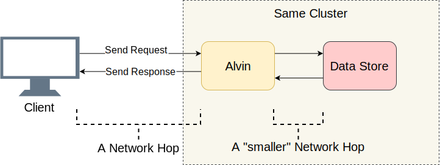

## Backdrop

As is the case in [many of my posts](https://mahdytech.com/2019/01/13/curious-case-999-latency-hike/) - a distributed service was misbehaving. Let's call this service Alvin. This time, I didn't discover the issue myself, it was reported by the client team instead.

I woke up one day to a disgruntled email, understandably so, due to very weird latencies concerning Alvin, that was to be launched soon. That was surprising for me - as I have thoroughly tested this service, especially the latency - their point of complaint.

Another look at the email verified one point - I didn't *exactly* test the conditions they mentioned. Their [QPS](https://en.wikipedia.org/wiki/Queries_per_second) was much lower than mine. I was testing with 40k QPS, while they were testing with only 1k.

I almost got ready to reply dismissing their results and asking them to redo it. After all, if 40k QPS have a [99%](https://en.wikipedia.org/wiki/Percentile) latency less than 10 ms*, how on earth can 1k QPS have a 50ms 99% latency? But I decided otherwise - let's humour them, and write back a scathing email how their numbers don't make sense. So I ran my experiment once again - with lower QPS this time.

Since I am blogging about this - you probably figured it out already: their numbers were correct. I re-ran my dummy client again and again, all with the same result: Lower QPS, not only leads to higher latencies, but just plain higher number of requests with latency over 10ms. This just smoldered all logic I knew about how services should act.

*All latency numbers reported in this article are within the same Data Center.

## Narrowing it Down

The first thing to do when faced with a latency issue is to shortlist the suspects list. Let's dig a bit deeper into Alvin's architecture: 

{.aligncenter}

A good starting point is to list the IO hops done (Network calls/Disk Lookups, etc), and try and figure out which one contains the latency delay. Besides the obvious IO between Alvin and its client,  Alvin is doing an extra IO step - it is calling into a Data Store. However, this Data Store lives in the same cluster with Alvin, so it should be a smaller network hop than the one between Client <=> Alvin. The following suspect list lines up:

1. Client => Alvin
2. Alvin => Data Store
3. Data Store Disk Lookup
4. Data Store => Alvin
5. Alvin => Client

Let's try to strike through some names.

### Data Store is Innocent

First thing I did was converting Alvin into a ping-ping sever: if latency improves, then my Alvin or Data Store's implementation has a bug - nothing unheard of. This yielded our first experiment graph:

Clearly no improvement, our suspect list is shortened to half:

1. Client => Alvin
2. Alvin => Client

I thought I was almost there, I was wrong.

### gRPC

Now is a good time to introduce a new player to the scene: [gRPC](https://github.com/grpc/grpc). `gRPC` is an open-source library by Google for intra-process [RPC](https://en.wikipedia.org/wiki/Remote_procedure_call) communication. While `gRPC` is highly optimized and heavily adopted, this was my first time using it on scale, and I was expecting that my usage was not optimal - to put it mildly.

Having `gRPC` on board introduced the new question: is the problem with my implementation, or is it with `gRPC`? A new suspect is added to the list: 

1. Client => gRPC (server)
2. gRPC (client) => gRPC (server)
3. gRPC (Server) => Alvin

My Client/Alvin implementation does not look a lot different from client/server [async examples](https://github.com/grpc/grpc/tree/v1.19.0/examples/cpp/helloworld). 

> Note: This is a bit of a simplification, since `gRPC` gives consumers power (boilerplate?) of using their own threading model resulting in a bit of intertwined execution stack between `gRPC` and consumer implementation. But let's keep it for the sake of clarity.

### Profile Cures All

At this point I figured: "Easy! I will take a profile and find out which part is causing the delay". A skim of this blog clearly shows I am a [big fan of precise profiling](https://mahdytech.com/2019/01/13/curious-case-999-latency-hike/), and for a reason: CPUs are blazing fast, and in the vast majority of my experience, they are not the bottleneck. Rather, it's usually the CPU having to stop processing to do something else that brings about delays. Precise CPU profiling is made just for that: it has an accurate record of all the context switching happening, and in so an idea of where delays are.

I took two profiles: one under high QPS (low latency), and one with PingPong low QPS server (high latency). And just for the heck of it, I also took a sampled CPU profile. To my dismay, however, nothing of substance was there. When doing this comparison, I am usually looking for an abnormal callstack. For example: the bad side showing a lot more context switching (10x or more) than the good side. But what I found was an almost matching context switching between good and bad runs.

Ahmed: 0  
Weird bug: 2 (wasted hours for running profile and analysis)

### Ignite the Network Engineer Within

- Run tracecert, ping, etc
- Send request within the machine, but using the machine's IP Address: problem persisted
- Send request from localhost, this improves latency!! Getting closer
- Tried using a dummy Windows and linux server Grpc servers, Linux was much better:
  - It's a Windows networking problem!!