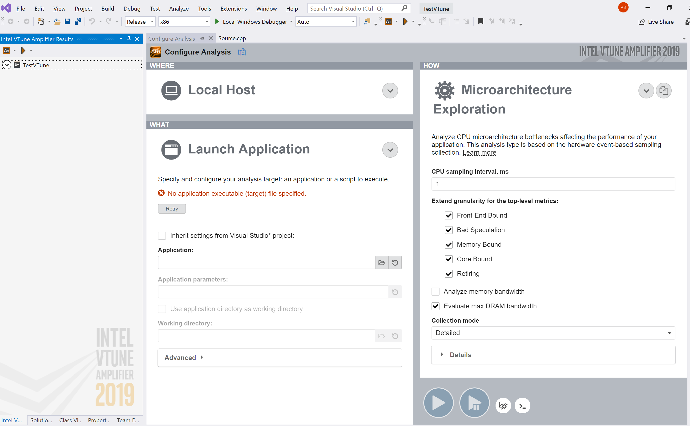
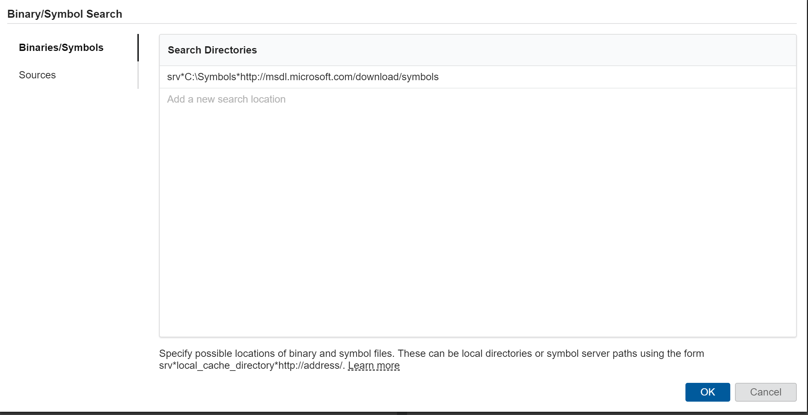
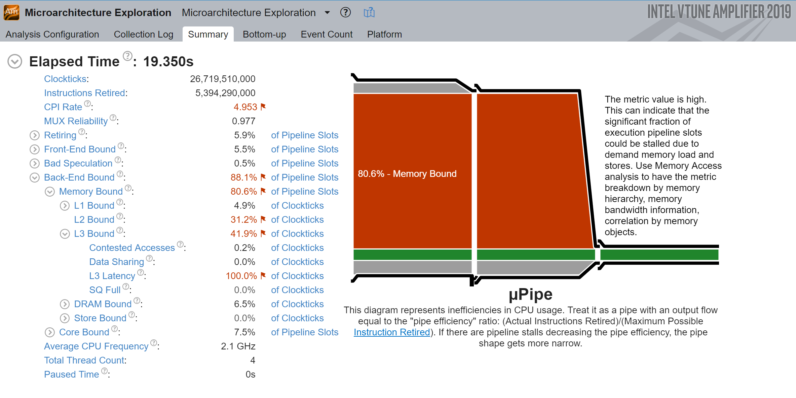
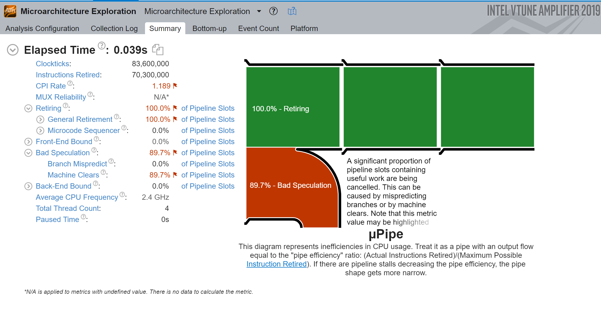

I had heard about [VTune](https://software.intel.com/en-us/vtune) a while ago as a hardcore profiler at the processor instruction level, however I never got the chance to play around with it. This blog - and maybe others in future - will narrate my trials to get a hang of VTune.

- [First things first: What's VTune](#First-things-first-Whats-VTune)
  - [Getting VTune](#Getting-VTune)
- [Let's Take VTune for a Ride: Cache Misses](#Lets-Take-VTune-for-a-Ride-Cache-Misses)
  - [Row-Major and Column-Major Array Access](#Row-Major-and-Column-Major-Array-Access)
  - [Profiling with VTune](#Profiling-with-VTune)
  - [Column-Major Access](#Column-Major-Access)
  - [Row-Major Access](#Row-Major-Access)
  - [Can We Make it Faster?](#Can-We-Make-it-Faster)
- [Conclusion](#Conclusion)

## First things first: What's VTune

VTune is a [profiler](https://en.wikipedia.org/wiki/Profiling_(computer_programming)), capable of a very similar job to CPU sampled profiling in [XPerf](https://mahdytech.com/2019/01/13/curious-case-999-latency-hike/#f1-profile0) or Visual Studio debugger. However, VTune has a huge edge: it supports hardware-based event sampling, using a special chip on Intel processors called the [Performance Monitoring Unit](https://software.intel.com/en-us/articles/intel-performance-counter-monitor) (PMU). VTune uses events reported by PMU to report a much more detailed description of instruction-level events, such as being [front-end bound](https://software.intel.com/en-us/vtune-amplifier-help-front-end-bound) or [back-end bound](https://software.intel.com/en-us/vtune-amplifier-help-back-end-bound).

Put in another way, while OS-reported CPU usage levels are effective in many (most?) cases, the time comes when we need deeper insight into which bottleneck the processor is facing, and how to make this piece of code faster. In my experience, this is mostly beneficial in tight loops or portions of the code on the ultra-hot path. In many cases, there are 50 lines of code that are responsible for more CPU usage than the thousands of lines in the rest of of the application, it is for those 50 lines that VTune can come in handy.

### Getting VTune

I was pleasantly surprised to see that personal use for VTune has become [free](https://software.intel.com/en-us/vtune/choose-download#standalone), I recall that up until recently it was only an evaluation. The 2019 edition comes with pretty sleek GUI and great integration with Visual Studio, using VTune from within Visual Studio is straightforward and fits nicely into the usual development cycle.



Note using "Microarchitecture Exploration" under the How, VTune is capable of doing User-Mode sampling, but I would rather use XPerf or [F1](https://docs.microsoft.com/en-us/visualstudio/profiling/how-to-install-the-stand-alone-profiler?view=vs-2019) for that.

## Let's Take VTune for a Ride: Cache Misses

We're always taught to build applications to be [cache-friendly](https://www.youtube.com/watch?v=WDIkqP4JbkE&feature=youtu.be), but such things are easier said than done. Now, if we can *detect* being non-cache friendly and fix it, that's powerful.

### Row-Major and Column-Major Array Access

The classic example for cache misses is usually the very simple array traversal problem. Say, we need to find sum of all elements in an array, we could either loop on rows, or on columns:

``` cpp
// row major
for (int i = 0; i < numRows; ++i)
    for (int j = 0; j < numColumns; ++j)
        sum += matrix[i][j];

// column major
for (int i = 0; i < numRows; ++i)
    for (int j = 0; j < numColumns; ++j)
        sum += matrix[j][i];
```

The column major traversal has a huge issue: it will trigger vastly more cache misses than row-major traversal.

> For an overview of what's a cache miss and CPU memory access costs checkout ["Why do CPUs have multiple cache levels?"](https://fgiesen.wordpress.com/2016/08/07/why-do-cpus-have-multiple-cache-levels/)

A picture makes things easier:


<center>Source: <a href=https://craftofcoding.wordpress.com/2017/02/03/column-major-vs-row-major-arrays-does-it-matter/>craftofcoding</a></center>

When element `1` is read, adjacent elements `2` and `3` are brought into cache, which comes in handy when we access them next, as we don't need to do a memory access again. However, in a column-major access pattern we lose this advantage, as after we bring `2` and `3` we don't access them and access `4` instead, and bring its neighbors: `5` and `6`, then, oops, we don't use that either and access `7`.

### How Fast is This

In order to test the effects of array access pattern, I made a tiny app that builds an array, then tries to sum its elements 1000 times, so as to emulate a real CPU effort without creating a humongous array. I created two versions, one with row-major and one with column-major access for the array as shown above.

<canvas class="js-chart" width="400" height="400" data-chart="
    {
        'data': [
            {
                'label': 'Row-major',
                'data': [33,27,197,111,57,223,1272,2809,12298,41725,208140]
            },
            {
                'label': 'Column-Major',
                'data': [16,23,32,85,257,976,3366,11967,75507,382699,2559339]
            }
        ]
    }
    " 
    data-labels-chart = "1,2,4,8,16,32,64,128,256,512,1024"
    data-yaxis-chart="logarithmic"
    data-yaxis-name = "Latency in Nanoseconds" data-xaxis-name = "Array Size"
    ></canvas>

The graph shows clearly that as array size goes beyond tiny, where whole array might even be cached, row-major access is the very clear winner. Let's see how VTune can profile this.

## Profiling with VTune

I started a profile, but I had forgotten to add symbols - and while the VTuner interface does not stress adding them, results were useless without symbols. Don't forget to add them from capture dialog:



<center>Adding Symbols to VTune</center>

Let's have a look at the results!

### Row-Major Access

Let's first have a look at row-major array access, in order to get a baseline for what looks "good".  


First things first, the 32.8% Retiring (in green) is the number to look for: it means out of all operations performed by the processor, 32% actually proved to be needed and got *retired*. Keep in mind that the processor tries to be a step ahead, and in a best case scenario this number should be as high as possible. 

The red box below shows we still have limitation with our implementaiton, we'll go back to this in a [bit](#Can-We-Make-it-Faster).

### Column-Major Access

Now that we have a baseline established, let's run the column-major code and profile that:



That's more like it. As trivial as this example is - I was impressed by the verbose verdict. We're getting a lot of cache misses, and accessing RAM too much.

### Can We Make it Faster

Before signing off, I wanted to explore improving the row-major access. The red part we had, showed we're `Core Bound`, which 

I had another look at my implementation and the problem was clear: I was using a `vector<vector<>>` instead of linearlizing the 2D array, so after finishing each row the processor would not be able to predict the next element. Replacing that with one array and rerunning VTune: 



Now that's what I am talking about. It is interesting how we can see more than 100% of instructions, since the processor can still make branch mispredictions even when retiring 100% of instructions.

## Conclusion

I am pretty impressed with VTune so far, and wonder how does it scale for profiling production-scale applications. Nonetheless, VTune is educational, I have learnt a bunch about hardware, for example what retired instructions are, even though I ran one of the simplest examples possible.

Code samples & VTune captures for those interested in further debugging are in the [post material](). Thanks for reading!
___

Help [improve this text]() or discuss it on [reddit](), [hackernews]().