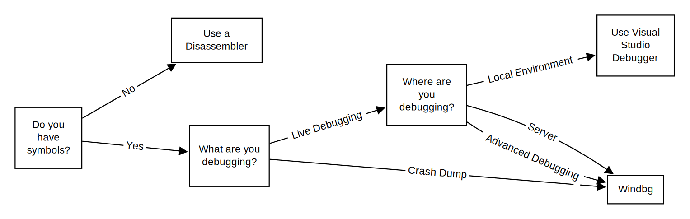

I am guilty of recommending Windbg to others in more situations than necessary – but I do believe it’s a very valuable tool for any Windows developer, and the learnings scale outside the borders of the application. 

Bad news is, it has a pretty steep learning curve. The good news: there is only so much you need to learn to get through 80% of scenarios!  I will try here to cover those first several commands to get someone started. 

## When to use Windbg? 

First requirement for using Windbg is **having access to symbols**. If you don’t, i.e. you’re debugging external code, then you should be considering reverse engineering tools like [IDA](https://github.com/AngelKitty/IDA7.0). Windbg kind of sucks for that kind of debugging. 

If you do have symbols, the next question is, what are you debugging? If it’s a crash dump, then Windbg is the defacto tool. If it’s for live debugging (attaching to a process), then we need to think about one more thing: where are you debugging? If it’s on a local machine, then Visual Studio debugger would be my go-to unless I need some of Windbg advanced extensions (`!heap` for example) 

There will be situations, however, where you need to debug an application on remote servers where Visual Studio is not installed. Windbg then comes in the picture. 

How to install? 
If at all possible I’d recommend using Windbgx (aka windbg next) (link), but sometimes we’re restricted to what we have on the servers. Windbg classic is not too bad either. 

My Top 10 commands! 
For those who’re used to Visual Studio debugging, using Windbg for the first time can be daunting (it def was for me!). Instead of the nice GUI, we need to know the commands we need for a successful debugging session. Here are my top commands for getting started: 

-	Attaching to a process
Not a command actually, but a startup parameter. If I am not deugging a crash dump, I attach to a process by running 
Windbg -pn <process_name_with_extension> 

-	Go (live debugging only) 
Once attached to a process, the process is usually completely stopped. In order to keep it going, you can use the command “go” or just “g” to tell the execution to continue

-	Display callstack
My first command when doing crash dump debugging: where are we now? What is the program trying to execute? 
> k
Keep an eye on the thread id in the bottom left. Sometimes breakpoints will stop in different places and this thread id is your only way to know which one you’re currently on. 

-	dv
display local variables. My first step after getting callstack is getting local variables for this frame. Pro tip: some variables will be optimized out in release builds, but if you go up or down a fram (by clicking each fram’s link) you can access them. Otherwise you will have to do some assembly ninja to infer their values from the registers
-	!uniqstack
Gives callstack across all threads, unlike “~* K”, it distills them to only the unique stacks. Very helpful in situations where there’s a deadlock or something and I want to quickly check for weird callstacks.  
-	.excr
If execution stops because of a thrown exception, this will give you exception details (_sometimes_ helpful) 
-	X module.dll!*substring_of_func_name*
If I know the function I want to break on, and especially if I don’t have the source file, I will first use this command to find its location in the binary, then use the next command to set a break point. You can also you use this command to find value of static variables! 
-	Bp <function>, bp <location>, bp <condition> 
My go to way of setting up break points is to try to find the source file, open it in Windbg, then use f9 to set break points in it. But this does not always work. Alternatively, I might want to setup conditional break points, in which case I use X to get location, then bp command to set my break points. Very useful! 
-	Sxe eh (live debugging only) 
This command is not very well known but it’s one of my favorites. Windbg by default does not break when an excpetion is thrown. A lot of the times, I am trying to exactly do that – break whenever an exception happens
-	.sympath+
In order to add another path where pdbs or a symbol server. It is almost always a good idea to add Microsoft’s public symbol server on the path if it is not already there. 

-	!analyze -v [crash dump only] 
Not actually one of my common commands, but I know some people who swear by it, so I will include it for completeness (and also to make the list a full 10). 
It analyzes the crash dump and prints a nice report, the most important part IMO is where it says where the crash happened and why (e.g. access violation) 

Conclusion
Windbg is extremely powerful, and I don’t think I am scratching the tip of the icerberg here, but this list should allow for at least a similar debugging experience to Visual Studio (albeit more laborious) 

One day I’d want to write more about heap debugging with windbg & using Time Trace Debugging (two more reasons to get to know windbg!), let me know if you find this helpful  

